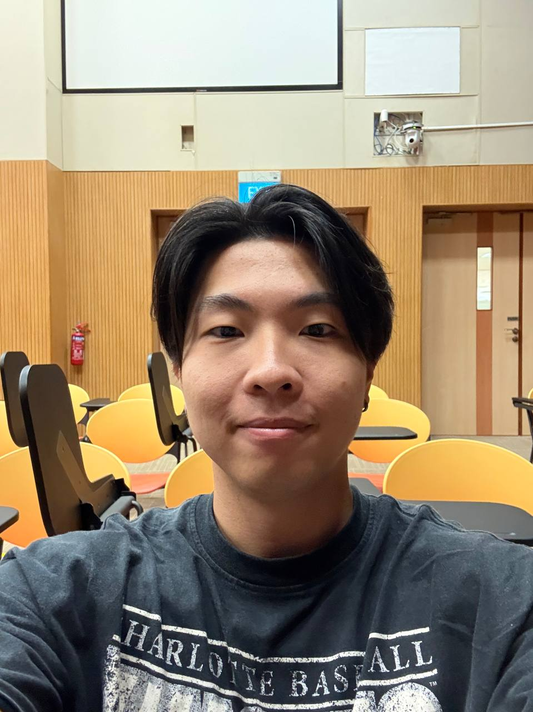
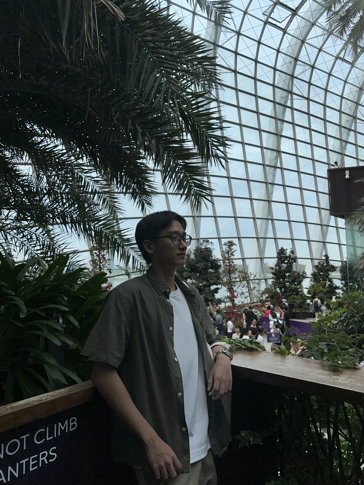
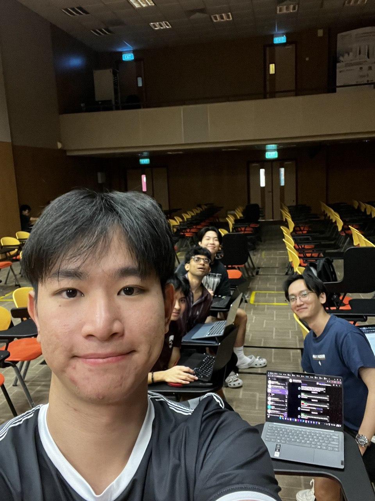

We are a team based in the [School of Computing, National University of Singapore](https://www.comp.nus.edu.sg).

You can reach us at the email `seer[at]comp.nus.edu.sg`

## Project team

### Lin Tao

[[homepage](http://www.comp.nus.edu.sg/~damithch)]
[[github](https://github.com/infinex123)]
[[portfolio](team/lintao.md)]

* Role: Project Advisor

### Jane Doe

[[github](http://github.com/johndoe)]
[[portfolio](team/johndoe.md)]

* Role: Team Lead
* Responsibilities: UI

### Johnny Doe

[[github](http://github.com/johndoe)] [[portfolio](team/johndoe.md)]

* Role: Developer
* Responsibilities: Data

### Josh Loh

[[github](http://github.com/JoshLohh)]
[[portfolio](team/joshloh.md)]

* Role: Developer
* Responsibilities: Dev Ops + Threading

### Yoson Teo

[[github](http://github.com/yosonteo)]
[[portfolio](team/yosonteo.md)]

* Role: Member
* Responsibilities: UI
