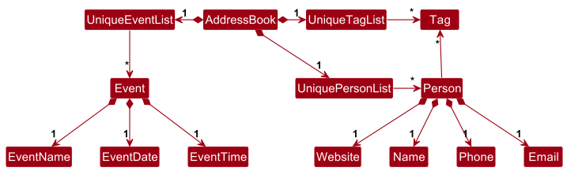

* Table of Contents
{:toc}

--------------------------------------------------------------------------------------------------------------------

## **Acknowledgements**

* {list here sources of all reused/adapted ideas, code, documentation, and third-party libraries -- include links to the original source as well}

--------------------------------------------------------------------------------------------------------------------

## **Setting up, getting started**

Refer to the guide [_Setting up and getting started_](SettingUp.md).

--------------------------------------------------------------------------------------------------------------------

## **Design**

:bulb: **Tip:** The `.puml` files used to create diagrams are in this document `docs/diagrams` folder. Refer to the [_PlantUML Tutorial_ at se-edu/guides](https://se-education.org/guides/tutorials/plantUml.html) to learn how to create and edit diagrams.

### Architecture

The ***Architecture Diagram*** given above explains the high-level design of the App.

Given below is a quick overview of main components and how they interact with each other.

**Main components of the architecture**

**`Main`** (consisting of classes [`Main`](https://github.com/se-edu/absolutsinema-level3/tree/master/src/main/java/seedu/address/Main.java) and [`MainApp`](https://github.com/se-edu/absolutsinema-level3/tree/master/src/main/java/seedu/address/MainApp.java)) is in charge of the app launch and shut down.
* At app launch, it initializes the other components in the correct sequence, and connects them up with each other.
* At shut down, it shuts down the other components and invokes cleanup methods where necessary.

The bulk of the app's work is done by the following four components:

* [**`UI`**](#ui-component): The UI of the App.
* [**`Logic`**](#logic-component): The command executor.
* [**`Model`**](#model-component): Holds the data of the App in memory.
* [**`Storage`**](#storage-component): Reads data from, and writes data to, the hard disk.

[**`Commons`**](#common-classes) represents a collection of classes used by multiple other components.

**How the architecture components interact with each other**

The *Sequence Diagram* below shows how the components interact with each other for the scenario where the user issues the command `delete 1`.

Each of the four main components (also shown in the diagram above),

* defines its *API* in an `interface` with the same name as the Component.
* implements its functionality using a concrete `{Component Name}Manager` class (which follows the corresponding API `interface` mentioned in the previous point.

For example, the `Logic` component defines its API in the `Logic.java` interface and implements its functionality using the `LogicManager.java` class which follows the `Logic` interface. Other components interact with a given component through its interface rather than the concrete class (reason: to prevent outside component's being coupled to the implementation of a component), as illustrated in the (partial) class diagram below.

The sections below give more details of each component.

### UI component

The **API** of this component is specified in [`Ui.java`](https://github.com/se-edu/absolutsinema-level3/tree/master/src/main/java/seedu/address/ui/Ui.java)

The UI consists of a `MainWindow` that is made up of parts e.g.`CommandBox`, `ResultDisplay`, `PersonListPanel`, `StatusBarFooter` etc. All these, including the `MainWindow`, inherit from the abstract `UiPart` class which captures the commonalities between classes that represent parts of the visible GUI.

The `UI` component uses the JavaFx UI framework. The layout of these UI parts are defined in matching `.fxml` files that are in the `src/main/resources/view` folder. For example, the layout of the [`MainWindow`](https://github.com/se-edu/absolutsinema-level3/tree/master/src/main/java/seedu/address/ui/MainWindow.java) is specified in [`MainWindow.fxml`](https://github.com/se-edu/absolutsinema-level3/tree/master/src/main/resources/view/MainWindow.fxml)

The `UI` component,

* executes user commands using the `Logic` component.
* listens for changes to `Model` data so that the UI can be updated with the modified data.
* keeps a reference to the `Logic` component, because the `UI` relies on the `Logic` to execute commands.
* depends on some classes in the `Model` component, as it displays `Person` object residing in the `Model`.

### Logic component

**API** : [`Logic.java`](https://github.com/se-edu/absolutsinema-level3/tree/master/src/main/java/seedu/address/logic/Logic.java)

Here's a (partial) class diagram of the `Logic` component:

The sequence diagram below illustrates the interactions within the `Logic` component, taking `execute("delete 1")` API call as an example.

:information_source: **Note:** The lifeline for `DeleteCommandParser` should end at the destroy marker (X) but due to a limitation of PlantUML, the lifeline continues till the end of diagram.

How the `Logic` component works:

1. When `Logic` is called upon to execute a command, it is passed to an `AbsolutSinemaParser` object which in turn creates a parser that matches the command (e.g., `DeleteCommandParser`) and uses it to parse the command.
1. This results in a `Command` object (more precisely, an object of one of its subclasses e.g., `DeleteCommand`) which is executed by the `LogicManager`.
1. The command can communicate with the `Model` when it is executed (e.g. to delete a person). 
   Note that although this is shown as a single step in the diagram above (for simplicity), in the code it can take several interactions (between the command object and the `Model`) to achieve.
1. The result of the command execution is encapsulated as a `CommandResult` object which is returned back from `Logic`.

Here are the other classes in `Logic` (omitted from the class diagram above) that are used for parsing a user command:

How the parsing works:
* When called upon to parse a user command, the `AbsolutSinemaParser` class creates an `XYZCommandParser` (`XYZ` is a placeholder for the specific command name e.g., `AddCommandParser`) which uses the other classes shown above to parse the user command and create a `XYZCommand` object (e.g., `AddCommand`) which the `AbsolutSinemaParser` returns back as a `Command` object.
* All `XYZCommandParser` classes (e.g., `AddCommandParser`, `DeleteCommandParser`, ...) inherit from the `Parser` interface so that they can be treated similarly where possible e.g, during testing.

### Model component
**API** : [`Model.java`](https://github.com/se-edu/absolutsinema-level3/tree/master/src/main/java/seedu/address/model/Model.java)

The `Model` component,

* stores the absolut sinema data i.e., all `Person` objects (which are contained in a `UniquePersonList` object).
* stores the currently 'selected' `Person` objects (e.g., results of a search query) as a separate _filtered_ list which is exposed to outsiders as an unmodifiable `ObservableList<Person>` that can be 'observed' e.g. the UI can be bound to this list so that the UI automatically updates when the data in the list change.
* stores a `UserPref` object that represents the user’s preferences. This is exposed to the outside as a `ReadOnlyUserPref` objects.
* does not depend on any of the other three components (as the `Model` represents data entities of the domain, they should make sense on their own without depending on other components)

:information_source: **Note:** An alternative (arguably, a more OOP) model is given below. It has a `Tag` list in the `AbsolutSinema`, which `Person` references. This allows `AbsolutSinema` to only require one `Tag` object per unique tag, instead of each `Person` needing their own `Tag` objects. 

### Storage component

**API** : [`Storage.java`](https://github.com/se-edu/absolutsinema-level3/tree/master/src/main/java/seedu/address/storage/Storage.java)

The `Storage` component,
* can save both absolut sinema data and user preference data in JSON format, and read them back into corresponding objects.
* inherits from both `AbsolutSinemaStorage` and `UserPrefStorage`, which means it can be treated as either one (if only the functionality of only one is needed).
* depends on some classes in the `Model` component (because the `Storage` component's job is to save/retrieve objects that belong to the `Model`)

### Common classes

Classes used by multiple components are in the `seedu.address.commons` package.

--------------------------------------------------------------------------------------------------------------------

## **Implementation**

This section describes some noteworthy details on how certain features are implemented.

### \[Proposed\] Undo/redo feature

#### Proposed Implementation

The proposed undo/redo mechanism is facilitated by `VersionedAbsolutSinema`. It extends `AbsolutSinema` with an undo/redo history, stored internally as an `absolutSinemaStateList` and `currentStatePointer`. Additionally, it implements the following operations:

* `VersionedAbsolutSinema#commit()` — Saves the current absolut sinema state in its history.
* `VersionedAbsolutSinema#undo()` — Restores the previous absolut sinema state from its history.
* `VersionedAbsolutSinema#redo()` — Restores a previously undone absolut sinema state from its history.

These operations are exposed in the `Model` interface as `Model#commitAbsolutSinema()`, `Model#undoAbsolutSinema()` and `Model#redoAbsolutSinema()` respectively.

Given below is an example usage scenario and how the undo/redo mechanism behaves at each step.

Step 1. The user launches the application for the first time. The `VersionedAbsolutSinema` will be initialized with the initial absolut sinema state, and the `currentStatePointer` pointing to that single absolut sinema state.

Step 2. The user executes `delete 5` command to delete the 5th person in the absolut sinema. The `delete` command calls `Model#commitAbsolutSinema()`, causing the modified state of the absolut sinema after the `delete 5` command executes to be saved in the `absolutSinemaStateList`, and the `currentStatePointer` is shifted to the newly inserted absolut sinema state.

Step 3. The user executes `add n/David …​` to add a new person. The `add` command also calls `Model#commitAbsolutSinema()`, causing another modified absolut sinema state to be saved into the `absolutSinemaStateList`.

:information_source: **Note:** If a command fails its execution, it will not call `Model#commitAbsolutSinema()`, so the absolut sinema state will not be saved into the `absolutSinemaStateList`.

Step 4. The user now decides that adding the person was a mistake, and decides to undo that action by executing the `undo` command. The `undo` command will call `Model#undoAbsolutSinema()`, which will shift the `currentStatePointer` once to the left, pointing it to the previous absolut sinema state, and restores the absolut sinema to that state.

:information_source: **Note:** If the `currentStatePointer` is at index 0, pointing to the initial AbsolutSinema state, then there are no previous AbsolutSinema states to restore. The `undo` command uses `Model#canUndoAbsolutSinema()` to check if this is the case. If so, it will return an error to the user rather
than attempting to perform the undo.

The following sequence diagram shows how an undo operation goes through the `Logic` component:

:information_source: **Note:** The lifeline for `UndoCommand` should end at the destroy marker (X) but due to a limitation of PlantUML, the lifeline reaches the end of diagram.

Similarly, how an undo operation goes through the `Model` component is shown below:

The `redo` command does the opposite — it calls `Model#redoAbsolutSinema()`, which shifts the `currentStatePointer` once to the right, pointing to the previously undone state, and restores the absolut sinema to that state.

:information_source: **Note:** If the `currentStatePointer` is at index `absolutSinemaStateList.size() - 1`, pointing to the latest absolut sinema state, then there are no undone AbsolutSinema states to restore. The `redo` command uses `Model#canRedoAbsolutSinema()` to check if this is the case. If so, it will return an error to the user rather than attempting to perform the redo.

Step 5. The user then decides to execute the command `list`. Commands that do not modify the absolut sinema, such as `list`, will usually not call `Model#commitAbsolutSinema()`, `Model#undoAbsolutSinema()` or `Model#redoAbsolutSinema()`. Thus, the `absolutSinemaStateList` remains unchanged.

Step 6. The user executes `clear`, which calls `Model#commitAbsolutSinema()`. Since the `currentStatePointer` is not pointing at the end of the `absolutSinemaStateList`, all absolut sinema states after the `currentStatePointer` will be purged. Reason: It no longer makes sense to redo the `add n/David …​` command. This is the behavior that most modern desktop applications follow.

The following activity diagram summarizes what happens when a user executes a new command:

#### Design considerations:

**Aspect: How undo & redo executes:**

* **Alternative 1 (current choice):** Saves the entire absolut sinema.
  * Pros: Easy to implement.
  * Cons: May have performance issues in terms of memory usage.

* **Alternative 2:** Individual command knows how to undo/redo by
  itself.
  * Pros: Will use less memory (e.g. for `delete`, just save the person being deleted).
  * Cons: We must ensure that the implementation of each individual command are correct.

_{more aspects and alternatives to be added}_

### \[Proposed\] Data archiving

_{Explain here how the data archiving feature will be implemented}_

--------------------------------------------------------------------------------------------------------------------

## **Documentation, logging, testing, configuration, dev-ops**

* [Documentation guide](Documentation.md)
* [Testing guide](Testing.md)
* [Logging guide](Logging.md)
* [Configuration guide](Configuration.md)
* [DevOps guide](DevOps.md)

--------------------------------------------------------------------------------------------------------------------

## **Appendix: Requirements**

### Product scope

**Target user profile**:

* Party planners who organize birthdays, anniversaries, and social gatherings
* Need to manage multiple vendor contacts (caterers, decorators, entertainers, venues)
* Track client information and party preferences
* Coordinate with various service providers for each party
* Handle multiple parties simultaneously
* Prefer desktop applications for quick data entry and retrieval
* Are reasonably comfortable with CLI commands for efficiency

**Value proposition**: AbsolutSin-ema helps party planners manage their contacts more efficiently than generic contact management apps by:

* Organizing vendor contacts by party type (birthday, anniversary, corporate, kids' parties)
* Quick filtering by vendor category (caterer, decorator, DJ, venue, photographer)
* Tracking vendor specialties (e.g., balloon artist, vegan caterer)
* Fast CLI-based access for busy planners juggling multiple events
* Tagging system for organizing by theme, budget tier, or reliability

---
### User stories

Priorities: High (must have) - `* * *`, Medium (should have) - `* *`, Low (nice to have) - `*`

| Priority | As a …​               | I want to …​                      | So that I can…​                                      |
| -------- | ---------------------- | --------------------------------- | ---------------------------------------------------- |
| `* * *`  | user                   | add new contacts                  | expand my event planner network                      |
| `* * *`  | user                   | delete contacts                   | remove unneeded or completed events                  |
| `* * *`  | user                   | tag/untag contacts                | organise my contacts effectively                     |
| `* * *`  | user                   | view a list of all contacts       | retrieve contact information quickly                 |
| `* *`    | user                   | edit contacts                     | update information upon changes                      |
| `* *`    | user                   | filter contacts by tag            | find specific profiles of interest                   |
| `* *`    | user                   | see a confirmation before delete  | avoid accidental data loss                           |
| `* *`    | first-time user        | see help messages                 | learn how to use the app                             |
| `*`      | user                   | archive contacts                  | prevent clutter without deleting                     |
| `*`      | user                   | sort contacts alphabetically      | organise and access easily                           |
| `*`      | user                   | undo latest action                | recover from mistakes                                |
| `*`      | user                   | import/export contacts (CSV)      | transfer or back up contacts                         |
| `*`      | user                   | add notes to contacts             | record extra details                                 |
| `*`      | user                   | set reminders                     | remember to communicate with vendors                 |
| `*`      | user                   | schedule calls                    | keep track of vendor follow-ups                      |
| `*`      | user                   | create events with associated contacts | manage all vendors for one event together        |
| `*`      | user                   | create todo lists for events      | manage tasks efficiently                             |
| `*`      | user                   | share contacts with colleagues    | allow team collaboration                             |
| `*`      | user                   | view statistics                   | monitor number of contacts and growth                |

---

### Use cases

(For all use cases below, the **System** is the `AbsolutSin-ema` app and the **Actor** is the `Party Planner`.)

**Use case UC01: Add a new caterer for kids' birthday parties**

**MSS**
1. Planner searches for existing caterer to avoid duplicates
2. System shows search results (none found)
3. Planner enters `add n/Happy Foods Catering p/91234567 e/info@happyfoods.sg a/123 Food Street t/caterer t/kids t/halal`
4. System validates all fields
5. System adds contact and shows success message

**Extensions**
* 4a. Duplicate detected → System shows error message, use case ends
* 4b. Invalid phone format → System shows error, user retries input

**Use case UC02: Find DJ for corporate party**

**MSS**
1. Planner enters `find dj`
2. System filters and shows all contacts tagged with `dj`
3. Planner reviews list
4. Planner enters `list` to return to full contact list

**Extensions**
* 2a. No DJs found → System shows "0 contacts listed", use case ends

**Use case UC03: Update decorator's service tags**

**MSS**
1. Planner views contact list
2. Planner identifies decorator at index 3
3. Planner enters `edit 3 t/decorator t/balloons t/elegant t/corporate`
4. System validates tags
5. System updates contact
6. System shows success message with updated info

---

### Non-Functional Requirements

**Performance**
1. System should respond to any command within 2 seconds
2. Contact list should load within 3 seconds even with 1000+ contacts

**Usability**
3. CLI users should perform basic operations without referring to docs
4. Error messages must clearly indicate fixes
5. Contact info should be easily readable in the GUI

**Scalability**
6. Handle at least 1000 vendor contacts without noticeable lag
7. Support at least 20 tags per contact

**Reliability**
8. Data auto-saved after each command
9. Recover gracefully from corrupted data files

**Portability**
10. Work on Windows, macOS, Linux
11. Distributed as a single JAR file

**Maintainability**
12. Code should follow OOP principles for easy extension
13. New vendor categories should be addable without code changes

---
### Glossary

| Term           | Definition                                                                 |
|----------------|----------------------------------------------------------------------------|
| Party Planner  | Professional who organizes and coordinates events                          |
| Vendor         | Service provider (caterer, decorator, entertainer, venue, etc.)            |
| Tag            | A label used to categorize contacts (e.g., `caterer`, `kids`, `halal`)     |
| Contact        | Vendor or client entry with name, phone, email, address, and tags          |
| CLI            | Command Line Interface, text-based commands                                |
| GUI            | Graphical User Interface, displays contacts visually                       |
| Index          | Numerical position of a contact in the displayed list                      |
| Service Type   | Category of vendor service (caterer, DJ, venue, etc.)                      |
| Party Theme    | Style of a party (princess, superhero, elegant, tropical)                  |
| MVP            | Minimum Viable Product, core features needed for release                   |
--------------------------------------------------------------------------------------------------------------------

## **Appendix: Instructions for manual testing**

Given below are instructions to test the app manually.

:information_source: **Note:** These instructions only provide a starting point for testers to work on;
testers are expected to do more *exploratory* testing.

### Launch and shutdown

1. Initial launch

   1. Download the jar file and copy into an empty folder

   1. Double-click the jar file Expected: Shows the GUI with a set of sample contacts. The window size may not be optimum.

1. Saving window preferences

   1. Resize the window to an optimum size. Move the window to a different location. Close the window.

   1. Re-launch the app by double-clicking the jar file. 
       Expected: The most recent window size and location is retained.

1. _{ more test cases …​ }_

### Deleting a person

1. Deleting a person while all persons are being shown

   1. Prerequisites: List all persons using the `list` command. Multiple persons in the list.

   1. Test case: `delete 1` 
      Expected: First contact is deleted from the list. Details of the deleted contact shown in the status message. Timestamp in the status bar is updated.

   1. Test case: `delete 0` 
      Expected: No person is deleted. Error details shown in the status message. Status bar remains the same.

   1. Other incorrect delete commands to try: `delete`, `delete x`, `...` (where x is larger than the list size) 
      Expected: Similar to previous.

1. _{ more test cases …​ }_

### Saving data

1. Dealing with missing/corrupted data files

   1. _{explain how to simulate a missing/corrupted file, and the expected behavior}_

1. _{ more test cases …​ }_
