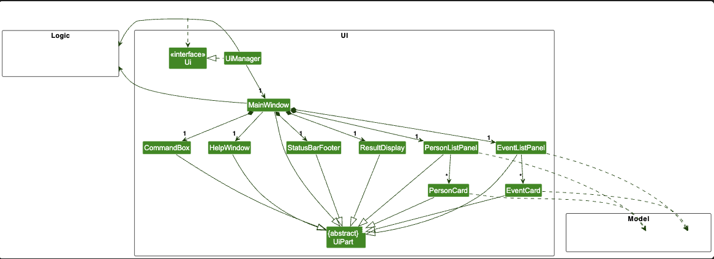
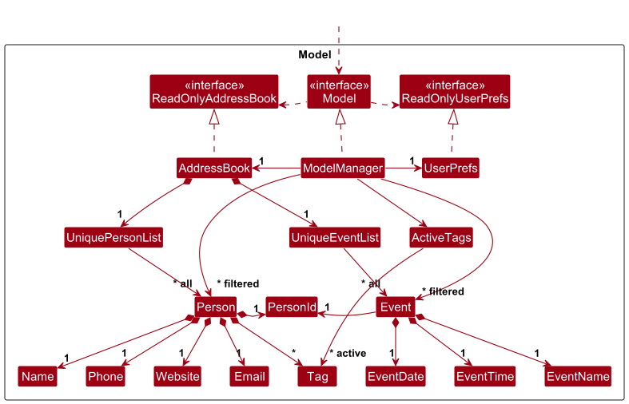
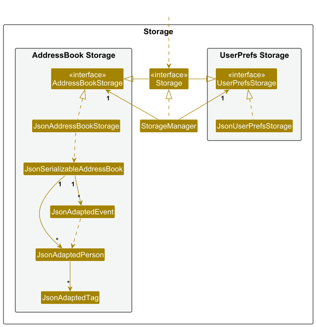
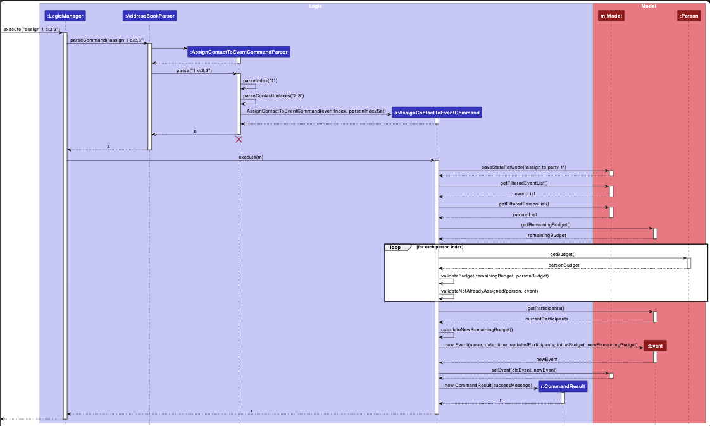

# AbsolutSin-ema Developer Guide

**AbsolutSin-ema** is a desktop application for party planners to manage contacts and events efficiently. It is optimized for use via a Command Line Interface (CLI) while still having the benefits of a Graphical User Interface (GUI). This guide provides comprehensive documentation for developers who wish to understand, maintain, or extend AbsolutSin-ema.

AbsolutSin-ema is an address book that is designed for party planners across all experience levels — from student organizers and hall committees to freelance coordinators and professional event teams. It serves individuals who manage guests, suppliers, and logistics, and who value fast, organized, and command-driven workflows that streamline event planning and communication.

## Table of Contents
- [Acknowledgements](#acknowledgements)
- [Setting up, getting started](#setting-up-getting-started)
- [Design](#design)
- [Component Details](#component-details)
- [Implementation](#implementation)
- [Documentation, logging, testing, configuration, dev-ops](#documentation-logging-testing-configuration-dev-ops)
- [Appendix: Requirements](#appendix-requirements)
  - [Product scope](#product-scope)
  - [User stories](#user-stories)
  - [Use cases](#use-cases)
  - [Non-Functional Requirements](#non-functional-requirements)
  - [Glossary](#glossary)
- [Appendix: Instructions for manual testing](#appendix-instructions-for-manual-testing)
- [Appendix: Effort](#appendix-effort)

--------------------------------------------------------------------------------------------------------------------

## **Acknowledgements**

* This project is based on the AddressBook-Level3 project created by the [SE-EDU initiative](https://se-education.org)
* JavaFX library for GUI components
* Jackson library for JSON serialization/deserialization
* JUnit5 for testing framework

--------------------------------------------------------------------------------------------------------------------

## **Setting up, getting started**

Refer to the guide [_Setting up and getting started_](SettingUp.md).

--------------------------------------------------------------------------------------------------------------------

## **Design**

<div markdown="span" class="alert alert-primary">

:bulb: **Tip:** The `.puml` files used to create diagrams are in this document `docs/diagrams` folder. Refer to the [_PlantUML Tutorial_ at se-edu/guides](https://se-education.org/guides/tutorials/plantUml.html) to learn how to create and edit diagrams.
</div>

### Architecture


The ***Architecture Diagram*** given above explains the high-level design of **AbsolutSin-ema**, a specialized contact management application designed for party planners to manage vendors, clients, and events efficiently.

**AbsolutSin-ema** is built on a **dual-entity system** that manages both **Persons** (vendors/clients) and **Events** (parties) with sophisticated relationship management, budget tracking, and assignment capabilities.

### Core Design Principles

1. **Domain-Specific Design**: Built specifically for party planning with vendor management, budget tracking, and event-person assignments
2. **Dual-Entity Architecture**: Separate but interconnected management of Persons and Events
3. **Budget-Aware Operations**: All assignments and operations consider budget constraints
4. **Robust Relationship Management**: PersonId system ensures data integrity across relationships
5. **Command-Driven Workflow**: CLI-first design optimized for power users

### Main Components

**`Main`** (consisting of classes [`Main`](https://github.com/AY2526S1-CS2103T-T12-4/tp/tree/master/src/main/java/seedu/address/Main.java) and [`MainApp`](https://github.com/AY2526S1-CS2103T-T12-4/tp/tree/master/src/main/java/seedu/address/MainApp.java)) handles app launch and shutdown:
* Initializes components in correct sequence and connects them
* Manages application lifecycle and graceful shutdown
* Handles configuration and logging initialization

The application's core functionality is delivered through four main components:

* [**`UI`**](#ui-component): The user interface layer
* [**`Logic`**](#logic-component): Command processing and business logic
* [**`Model`**](#model-component): Data models and business rules
* [**`Storage`**](#storage-component): Data persistence and retrieval

**`Commons`** provides shared utilities used across components.

### Component Interaction

The *Sequence Diagram* below shows how the components interact for the command `delete 1`:


Each component:
* Defines its API in an `interface` with the same name as the Component
* Implements functionality using a concrete `{Component Name}Manager` class
* Interacts with other components through interfaces to maintain loose coupling


--------------------------------------------------------------------------------------------------------------------

## **Component Details**

### UI Component

**API**: [`Ui.java`](https://github.com/AY2526S1-CS2103T-T12-4/tp/tree/master/src/main/java/seedu/address/ui/Ui.java)



The UI consists of a `MainWindow` containing specialized components:

**Core UI Components:**
* `CommandBox`: Handles CLI input with validation and auto-completion hints
* `ResultDisplay`: Shows command results and error messages
* `PersonListPanel`: Displays vendor/client contacts with tags and budget info
* `EventListPanel`: Shows events/parties with participant counts and budget status
* `StatusBarFooter`: Displays application state and file save status
* `HelpWindow`: Comprehensive help system with scrollable command reference

**Key UI Features:**
* **Dual-panel design**: Separate views for persons and events
* **Budget visualization**: Color-coded budget indicators in both panels
* **Tag-based filtering**: Visual tag representation for quick identification
* **Real-time updates**: Observable list bindings ensure immediate UI updates
* **Responsive layout**: Adapts to different screen sizes and window states

The UI uses JavaFX framework with FXML layouts stored in `src/main/resources/view`. Each UI component inherits from `UiPart<T>` which provides common functionality for GUI elements.

### Logic Component

**API** : [`Logic.java`](https://github.com/AY2526S1-CS2103T-T12-4/tp/tree/master/src/main/java/seedu/address/logic/Logic.java)

Here's the class diagram of the `Logic` component:


**Command Processing Flow:**

1. `LogicManager` receives user input and delegates to `AddressBookParser`
2. `AddressBookParser` creates appropriate `XYZCommandParser` based on command word
3. Parser validates input and creates `XYZCommand` object
4. `LogicManager` executes command with `Model` interaction
5. Command returns `CommandResult` with success/error information

**Specialized Parsers:**

* `AddEventCommandParser`: Handles complex event creation with optional contact assignments
* `AssignContactToEventCommandParser`: Manages bulk contact-to-event assignments with budget validation
* `FindCommandParser`: Supports both name and tag-based searching
* `EditCommandParser` / `EditEventCommandParser`: Handle partial updates with validation

**Advanced Features:**
* **Budget validation**: Commands validate budget constraints before execution
* **Undo system**: Commands save state for undo functionality via `model.saveStateForUndo()`
* **Index validation**: Robust checking of user-provided indexes against current filtered lists
* **Confirmation flows**: Multi-step commands like `clear` require confirmation


### Model Component

**API**: [`Model.java`](https://github.com/AY2526S1-CS2103T-T12-4/tp/tree/master/src/main/java/seedu/address/model/Model.java)



**Core Model Classes:**

**`AddressBook`**: Central data container managing both persons and events
* `UniquePersonList`: Maintains person data with duplicate prevention
* `UniqueEventList`: Manages events with name-based uniqueness checking
* Deep copying mechanisms for undo functionality

**`Person`**: Represents vendors/clients with specialized fields
* `PersonId`: Unique identifier for relationship management
* `Name`, `Phone`, `Email`: Standard contact information
* `Website`: Vendor-specific field for online presence
* `Budget`: Vendor service cost for budget calculations
* `Set<Tag>`: Flexible categorization system

**`Event`**: Represents parties/gatherings with comprehensive management
* `EventName`, `EventDate`, `EventTime`: Basic event information
* `List<PersonId>`: Participants assigned to the event
* `Budget initialBudget`: Total budget allocated for the event
* `Budget remainingBudget`: Budget remaining after assignments

**Advanced Model Features:**

1. **Budget Management System:**
   ```java
   // Budget validation during assignment
   if (eventBudget < personBudget) {
       throw new CommandException("Budget exceeded");
   }
   remainingBudget = eventBudget - personBudget;
   ```

2. **Relationship Integrity:**
   ```java
   // PersonId ensures referential integrity
   List<PersonId> participants = event.getParticipants();
   // Relationships persist across person edits
   ```

3. **Observable Lists:**
   ```java
   ObservableList<Person> getFilteredPersonList();
   ObservableList<Event> getFilteredEventList();
   // UI automatically updates when data changes
   ```

The Model is completely independent of UI and Storage components, following clean architecture principles.

### Storage Component

**API**: [`Storage.java`](https://github.com/AY2526S1-CS2103T-T12-4/tp/tree/master/src/main/java/seedu/address/storage/Storage.java)



**Storage Architecture:**

* `StorageManager`: Coordinates between AddressBook and UserPrefs storage
* `JsonAddressBookStorage`: Persists dual-entity data in JSON format
* `JsonUserPrefsStorage`: Manages user preferences and settings

**JSON Adapters:**
* `JsonAdaptedPerson`: Serializes Person objects with PersonId preservation
* `JsonAdaptedEvent`: Handles Event serialization with participant relationships
* `JsonAdaptedTag`: Manages tag serialization
* `JsonSerializableAddressBook`: Root container for complete data export/import

**Key Storage Features:**

1. **Automatic Saving**: Data persists after every state-changing command
2. **Graceful Recovery**: Handles corrupted files by clearing data
3. **Relationship Preservation**: PersonId references maintained across sessions
4. **User Preferences**: Window size, position, and view preferences saved

### Common classes

Classes used by multiple components are in the `seedu.address.commons` package. These include:

* **`LogsCenter`**: Handles application-wide logging functionality
* **`Config`**: Manages application configuration settings
* **`Messages`**: Contains common message templates and constants
* **`JsonUtil`**: Provides JSON serialization and file I/O utilities
* **`StringUtil`**: Common string manipulation and validation helpers
* **`AppUtil`**: General application utilities and argument validation

--------------------------------------------------------------------------------------------------------------------

## **Implementation**

This section describes noteworthy implementation details of key features.

### Budget Management System

#### Overview

AbsolutSin-ema implements sophisticated budget tracking for both individual vendors and events. This system ensures financial constraints are respected when assigning vendors to events.

#### Implementation

**Budget Components:**
* `Budget` class: Validates and stores monetary values
* Event budget tracking: Initial vs. remaining budget separation
* Person budget: Service cost for vendor assignments

**Budget Validation Algorithm:**
```java
public void validateAssignment(Person person, Event event) {
    double personCost = Double.parseDouble(person.getBudget().value);
    double remainingBudget = Double.parseDouble(event.getRemainingBudget().value);

    if (remainingBudget < personCost) {
        throw new CommandException("Budget exceeded");
    }
}
```

**Budget Updates:**
When assigning contacts to events, the system:
1. Validates each person's cost against remaining budget
2. Updates remaining budget after successful assignment
3. Prevents over-budget assignments
4. Maintains budget history for undo operations

#### Design Considerations

**Alternative 1 (current choice):** Real-time budget validation
* Pros: Immediate feedback, prevents budget violations
* Cons: More complex assignment logic

**Alternative 2:** Post-assignment budget checking
* Pros: Simpler implementation
* Cons: Could allow budget violations

### Event-Person Assignment System

#### Overview

The assignment system manages complex relationships between vendors and events with budget constraints and participant tracking.

#### Implementation

The following sequence diagram shows how the assign command works when a user executes `assign 1 c/2,3`:



**Assignment Command Flow:**
1. `AssignContactToEventCommand` receives event index and person indexes
2. Validates all indexes against current filtered lists
3. Checks for existing assignments to prevent duplicates
4. Validates budget constraints for each assignment
5. Updates event with new participants and adjusted budget
6. Saves state for undo functionality

**Key Implementation Details:**

```java
// Collect and validate persons with budget checking
private List<Person> collectAndValidatePersons(List<Person> lastShownList,
        Event eventToModify, double eventBudget) throws CommandException {
    List<Person> result = new ArrayList<>();
    for (Index i : assignedPersonIndexList) {
        Person personToAdd = lastShownList.get(i.getZeroBased());
        double personBudget = parseBudgetSafe(personToAdd.getBudget().value);

        if (eventBudget < personBudget) {
            throw new CommandException("Budget exceeded for " + personToAdd.getName());
        }
        eventBudget -= personBudget;
        result.add(personToAdd);
    }
    return result;
}
```

**Assignment Features:**
* Bulk assignment: Multiple contacts in single command (`assign 1 c/2,3,4`)
* Budget validation: Automatic checking during assignment
* Duplicate prevention: Cannot assign same person multiple times
* State preservation: Full undo support for assignments

### Undo System Implementation

#### Overview

AbsolutSin-ema implements a state-saving undo system that captures application state before destructive operations.

#### Implementation

**State Management:**
```java
// Before executing state-changing command
model.saveStateForUndo("description of operation");

// Execute operation
performOperation();

// Undo restores previous state
model.undo(); // Restores to saved state
```

**Undo-Capable Commands:**
* Person management: `add`, `delete`, `edit`, `clear`
* Event management: `addp`, `deletep`, `editp`
* Assignments: `assign`, `unassign`

**State Saving Strategy:**
* Deep copy of entire AddressBook before modification
* Operation description for user feedback
* Single-level undo (most recent operation only)

#### Design Considerations

**Current Implementation:**
* Pros: Simple and reliable
* Cons: Memory intensive for large datasets

**Alternative Approach:** Command-specific undo
* Pros: Memory efficient
* Cons: Complex implementation, higher error potential

### Search and Filter System

#### Overview

Advanced search capabilities supporting both name-based and tag-based filtering across persons and events.

#### Implementation

**Search Components:**
* `FindCommand`: Unified search across name and tag fields
* `NameAndTagContainsKeywordsPredicate`: Advanced filtering logic
* Real-time result updates in UI


### Event Management System

#### Implementation

The event management system allows party planners to create and manage events (parties), track budgets, and assign contacts (vendors/clients) to specific events. This feature is fully integrated with the person management system.

**Key Components:**

1. **Event Entity** (`seedu.address.model.event.Event`)
   - Stores event details: `EventName`, `EventDate`, `EventTime`
   - Manages budgets: `initialBudget` and `remainingBudget`
   - Tracks participants via a list of `PersonId` references
   - Implements `isSameEvent()` method to prevent duplicate events

2. **Event Commands:**
   - `AddEventCommand` (`addp`) - Creates a new event with name, date, time, and budget
   - `EditEventCommand` (`editp`) - Modifies existing event details
   - `DeleteEventCommand` (`deletep`) - Removes an event from the system
   - `AssignContactToEventCommand` (`assign`) - Links one or more contacts to an event as participants (format: `assign EVENT_INDEX c/CONTACT_INDEXES`)
   - `UnassignContactFromEventCommand` (`unassign`) - Removes one or more contacts from an event (format: `unassign EVENT_INDEX c/CONTACT_INDEXES`)
   - `ViewCommand` (`view`) - Displays all participants for a specific event

3. **Budget Tracking:**
   - Each event tracks both initial and remaining budget
   - Each person (vendor) has an associated budget cost
   - When a person is assigned to an event, the remaining budget can be adjusted
   - Budget validation ensures sufficient funds are available

4. **UI Components:**
   - `EventListPanel` - Displays all events in the system
   - `EventListCard` - Shows individual event details including name, date, time, and budget

**How Event-Person Association Works:**

Events don't store full `Person` objects, but rather `PersonId` references. This design:
- Prevents data duplication
- Ensures person updates automatically reflect in associated events
- Allows efficient querying of participants via `Model#getPersonById(PersonId)`

**Example Usage Scenario:**

1. Party planner creates a new birthday party: `addp n/Birthday Party d/2024-12-25 t/18:00 b/5000`
2. System creates event with $5000 budget
3. Planner assigns caterer to event: `assign 1 c/1` (assigns contact at index 1 to event at index 1)
4. Planner can assign multiple contacts at once: `assign 1 c/2,3,4` (assigns contacts 2, 3, and 4 to event 1)
5. Planner can view all vendors/participants: `view 1`
6. If needed, planner can unassign: `unassign 1 c/1` (removes contact 1 from event 1)

### Confirmation System for Destructive Operations

#### Implementation

To prevent accidental data loss, the application implements a confirmation system for the `clear` command, which deletes all contacts and events.

**How it works:**

1. When user executes `clear`, the `ClearCommand` displays a warning message:
   ```
   Are you sure you want to clear the party planner? (Type 'y' to confirm, 'n' to cancel)
   ```
2. User must type `y` to confirm or `n` to cancel the operation
3. If confirmed, the `ConfirmClearCommand` performs the actual data deletion
4. If cancelled, the operation is aborted and no data is lost

**Design Rationale:**
- Destructive operations like `clear` are irreversible (even with undo, losing all data is risky)
- Interactive confirmation with explicit yes/no response provides a strong safety net
- The confirmation message clearly explains what will happen and how to proceed
- User-friendly prompts reduce the chance of accidental data loss from typos or misclicks
- Could be extended to other dangerous operations (e.g., bulk delete) in future versions

### [Proposed] Data archiving

**Search Algorithm:**
```java
public boolean test(Person person) {
    // Name matching (case-insensitive)
    boolean nameMatch = keywords.stream()
        .anyMatch(keyword -> StringUtil.containsWordIgnoreCase(
            person.getName().fullName, keyword));

    // Tag matching
    boolean tagMatch = person.getTags().stream()
        .anyMatch(tag -> keywords.stream()
            .anyMatch(keyword -> StringUtil.containsWordIgnoreCase(
                tag.tagName, keyword)));

    return nameMatch || tagMatch;
}
```

**Search Features:**
* Multi-keyword support: `find john caterer` matches name OR tag
* Case-insensitive matching
* Partial word matching
* Tag-specific searching: `find caterer` shows all caterers
* Real-time filtering with immediate UI updates

--------------------------------------------------------------------------------------------------------------------

## **Documentation, logging, testing, configuration, dev-ops**

* [Documentation guide](Documentation.md)
* [Testing guide](Testing.md)
* [Logging guide](Logging.md)
* [Configuration guide](Configuration.md)
* [DevOps guide](DevOps.md)

--------------------------------------------------------------------------------------------------------------------

## **Appendix: Requirements**

### Product scope

**Target user profile**:

AbsolutSin-ema targets **professional party planners** who:
* Organize multiple events simultaneously (birthdays, anniversaries, corporate events)
* Manage extensive vendor networks (caterers, decorators, entertainers, venues)
* Track budgets across multiple projects
* Need quick access to vendor information during planning
* Prefer efficient CLI tools over slower GUI applications
* Handle time-sensitive vendor assignments and budget allocations

**Value proposition**: **AbsolutSin-ema** helps party planners manage their contacts more efficiently than generic contact management apps by:

AbsolutSin-ema provides party planners with:
* **Specialized vendor management**: Custom fields (website, budget) for vendor-specific needs
* **Integrated event planning**: Connect vendors to specific events with budget tracking
* **Budget control**: Real-time budget validation prevents overspending
* **Efficient workflow**: CLI commands optimized for rapid data entry and retrieval
* **Relationship management**: Track which vendors work on which events
* **Professional organization**: Tag-based categorization for vendor specialties

---

### User stories

Priorities: High (must have) - `* * *`, Medium (should have) - `* *`, Low (nice to have) - `*`

| Priority | As a…                  | I want to…                                      | So that I can…                                          |
| -------- | ---------------------- | ----------------------------------------------- |---------------------------------------------------------|
| `* * *`  | party planner          | add vendor contacts | contact the vendor                                      |
| `* * *`  | party planner          | add vendor contacts with budget info           | track service costs for budget planning                 |
| `* * *`  | party planner          | create events with budgets                      | manage individual party finances                        |
| `* * *`  | party planner          | assign vendors to specific events               | organize who's working on each party                    |
| `* * *`  | party planner          | see budget validation during assignments       | avoid overspending on events                            |
| `* * *`  | party planner          | view all vendors and events in one app         | have centralized party planning management              |
| `* *`    | busy party planner     | quickly find vendors by specialty tags         | locate appropriate services for specific party themes   |
| `* *`    | party planner          | edit vendor and event information              | keep information current as details change              |
| `* *`    | party planner          | see confirmation before deleting data          | prevent accidental loss of important vendor information |
| `* *`    | party planner          | undo recent changes                             | recover from mistakes during rapid data entry           |
| `* *`    | new user               | access comprehensive help                       | learn the system quickly without external documentation |
| `*`      | experienced planner    | assign multiple vendors to events at once      | speed up event setup for large parties                  |
| `*`      | budget-conscious planner| see remaining budget for each event           | make informed vendor selection decisions                |
| `*`      | organized planner      | export vendor and event data                    | create reports or backup information                    |
| `*`      | collaborative planner  | share vendor lists with team members           | coordinate with assistants and partners                 |

---

### Use cases

(For all use cases below, the **System** is `AbsolutSin-ema` and the **Actor** is the `Party Planner`)

**Use case UC01: Add specialized vendor with budget**

**MSS**
1. Planner enters `add n/Elite Catering p/91234567 e/info@elite.com w/www.elite.com t/caterer t/halal b/150`
2. System validates all required fields and budget format
3. System creates vendor entry with unique PersonId
4. System displays success message with vendor details
5. System updates vendor list display

**Extensions**
* 2a. Duplicate vendor name detected
  * 2a1. System shows error message "This person already exists in the address book"
  * 2a2. Use case ends
* 2b. Invalid budget format
  * 2b1. System shows "Budget should only contain numbers, and it should be at least 0."
  * 2b2. Planner corrects input, use case resumes at step 1

**Use case UC02: Create event and assign vendors with budget validation**

**MSS**
1. Planner enters `addp n/Sarah's Birthday d/15-12-2024 t/19:00 b/500 c/1,3,5`
2. System validates event details and contact indexes
3. System retrieves vendor costs for contacts 1, 3, and 5
4. System validates total vendor costs (150+100+75=325) against event budget (500)
5. System creates event with assigned vendors
6. System updates event remaining budget to 175 (500-325)
7. System displays success message with event and assignment details

**Extensions**
* 4a. Vendor costs exceed event budget
  * 4a1. System shows "The budget of {vendor} exceeds the remaining budget of the party."
  * 4a2. Use case ends, no event created
* 3a. Invalid contact index provided
  * 3a1. System shows "The person index provided is invalid"
  * 3a2. Use case ends

**Use case UC03: Assign additional vendors to existing event**

**MSS**
1. Planner views event list and identifies target event at index 2
2. Planner enters `assign 2 c/4,7`
3. System retrieves event at index 2 and its remaining budget
4. System validates vendor costs against remaining budget
5. System checks vendors 4 and 7 are not already assigned
6. System updates event participant list and adjusts remaining budget
7. System displays success message with assigned vendor names

**Extensions**
* 4a. Insufficient remaining budget
  * 4a1. System shows "The budget of {vendor} exceeds the remaining budget of the party."
  * 4a2. Use case ends, no assignments made
* 5a. Vendor already assigned to event
  * 5a1. System shows "{vendor} has already been assigned to this party."
  * 5a2. Use case ends

**Use case UC04: Search vendors by specialty and assign to event**

**MSS**
1. Planner enters `find photographer` to locate photographers
2. System filters vendor list showing only vendors tagged with "photographer"
3. Planner reviews filtered list and identifies suitable vendor at index 2
4. Planner enters `assign 1 c/2` to assign photographer to event 1
5. System validates assignment and updates event
6. Planner enters `list` to return to full vendor view

**Extensions**
* 2a. No photographers found
  * 2a1. System shows "0 persons listed!"
  * 2a2. Use case ends

---

### Non-Functional Requirements

**Performance Requirements**
1. Command execution should complete within 2 seconds on a standard desktop
2. Application should handle up to 1000 vendors and 100 events without performance degradation
3. Search results should appear within 1 second for any query
4. UI updates should be immediate when data changes

**Usability Requirements**
5. New users should successfully create vendors and events within 10 minutes using help
6. Error messages should clearly indicate the problem and suggest fixes
7. CLI commands should follow consistent syntax patterns
8. GUI should be readable on screen resolutions from 1024x768 upward

**Reliability Requirements**
9. Data should auto-save after every successful command
10. Application should recover gracefully from corrupted data files
11. Budget calculations should be accurate to 2 decimal places
12. Undo functionality should reliably restore previous state

**Compatibility Requirements**
13. Should run on Windows 10+, macOS 10.15+, and Ubuntu 18.04+
14. Requires Java 17 or higher
15. Should work offline without internet connectivity
16. Data files should be portable across operating systems

**Maintainability Requirements**
17. New command types should be addable without modifying existing commands
18. New vendor fields should be addable through configuration
19. Code should follow established design patterns for consistency
20. Component interfaces should remain stable across versions

---

### Glossary

| Term                      | Definition                                                                    |
|---------------------------|-------------------------------------------------------------------------------|
| **AbsolutSin-ema**        | The name of this party planning contact and event management application   |
| **Party Planner**         | Professional who organizes and coordinates events and parties                 |
| **Vendor/Person/Contact** | Service provider such as caterer, decorator, entertainer, venue, photographer |
| **Event/Party**           | A planned gathering such as birthday, anniversary, wedding, corporate event   |
| **Assignment**            | The process of allocating vendors to work on specific events                  |
| **Budget**                | Monetary amount allocated for vendor services or event expenses               |
| **Tag**                   | Label used to categorize vendors by specialty (e.g., caterer, halal, elegant)|
| **PersonId**              | Unique identifier ensuring data integrity across vendor-event relationships   |
| **CLI**                   | Command Line Interface - text-based commands for rapid data manipulation     |
| **GUI**                   | Graphical User Interface, displays contacts and events visually            |
| **Index**                 | Numerical position of vendor/event in the currently displayed list           |
| **Service Type**          | Category of vendor service (caterer, DJ, venue, etc.)                      |
| **Party Theme**           | Style of a party (princess, superhero, elegant, tropical)                  |
| **MVP**                   | Minimum Viable Product, core features needed for release 
| **Remaining Budget**      | Event budget minus already assigned vendor costs                            |
| **Bulk Assignment**       | Assigning multiple vendors to an event in a single command                  |

--------------------------------------------------------------------------------------------------------------------

## **Appendix: Instructions for manual testing**

Given below are instructions to test AbsolutSin-ema manually.

<div markdown="span" class="alert alert-info">:information_source: **Note:** These instructions provide a starting point for testers. Testers are expected to do more *exploratory* testing beyond these scenarios.
</div>

### Launch and shutdown

1. **Initial launch**
   1. Download the jar file and copy into an empty folder
   2. Double-click the jar file
   3. **Expected**: GUI appears with sample vendors and events. Window may not be optimally sized.

2. **Saving window preferences**
   1. Resize window to a comfortable size and move to preferred location
   2. Close the window
   3. Re-launch the app by double-clicking the jar file
   4. **Expected**: Window appears in the same size and location as before closing

### Vendor management

1. **Adding a vendor with all fields**
   1. Test case: `add n/John's Catering p/98765432 e/john@catering.com w/www.johnscatering.com t/caterer t/halal b/200`
   2. **Expected**: New vendor appears in list with all specified details. Success message shows vendor details.

   3. Test case: `add n/John's Catering p/91234567 e/different@email.com w/different.com t/caterer b/150`
   4. **Expected**: Error message indicating vendor already exists (duplicate name detection).

   5. Test case: `add n/Invalid p/123 e/bad-email w/bad-url t/test b/-50`
   6. **Expected**: Error messages for invalid phone, email, website, and negative budget.

2. **Editing vendor information**
   1. Prerequisites: At least one vendor in the list
   2. Test case: `edit 1 p/87654321 b/250`
   3. **Expected**: First vendor's phone and budget updated. Success message displays changes.

   4. Test case: `edit 0 n/Invalid Name`
   5. **Expected**: Error message indicating invalid index.

### Event management

1. **Creating events with budget**
   1. Test case: `addp n/Birthday Party d/25-12-2024 t/18:00 b/1000`
   2. **Expected**: New event created with specified budget. Event appears in event list.

   3. Test case: `addp n/Birthday Party d/25-12-2024 t/18:00 b/500`
   4. **Expected**: Error message indicating duplicate event (same name).

   5. Test case: `addp n/Wedding d/invalid-date t/25:00 b/abc`
   6. **Expected**: Error messages for invalid date, time, and budget formats.

2. **Creating events with initial vendor assignments**
   1. Prerequisites: At least 3 vendors with known budgets
   2. Test case: `addp n/Corporate Event d/15-01-2025 t/14:00 b/2000 c/1,2,3`
   3. **Expected**: Event created with vendors 1, 2, 3 assigned. Remaining budget calculated correctly.

   4. Test case: `addp n/Small Party d/20-01-2025 t/12:00 b/100 c/1,2,3`
   5. **Expected**: Error if total vendor costs exceed event budget of 100.

### Assignment system

1. **Assigning vendors to events**
   1. Prerequisites: Events and vendors exist, view current budgets
   2. Test case: `assign 1 c/2,3`
   3. **Expected**: Vendors 2 and 3 assigned to event 1. Budget updated correctly. Success message lists assigned vendor names.

   4. Test case: `assign 1 c/2`
   5. **Expected**: Error message if vendor 2 already assigned to event 1.

   6. Test case: `assign 1 c/99`
   7. **Expected**: Error message for invalid vendor index.

2. **Budget validation during assignment**
   1. Prerequisites: Event with low remaining budget, expensive vendors available
   2. Test case: `assign 1 c/5` (where vendor 5's cost exceeds event 1's remaining budget)
   3. **Expected**: Error message indicating budget exceeded, no assignment made.

### Search and filter

1. **Finding vendors by name and tags**
   1. Test case: `find caterer`
   2. **Expected**: Shows all vendors tagged with "caterer".

   3. Test case: `find john`
   4. **Expected**: Shows vendors with "john" in their name.

   5. Test case: `find caterer photographer`
   6. **Expected**: Shows vendors tagged with either "caterer" OR "photographer".

   7. Test case: `find nonexistent`
   8. **Expected**: Shows "0 persons listed!" message.

### Undo functionality

1. **Undoing recent operations**
   1. Prerequisites: Perform any state-changing command (add, edit, assign, etc.)
   2. Test case: `undo`
   3. **Expected**: Previous operation reversed, data restored to prior state.

   4. Test case: `undo` (when no previous operation exists)
   5. **Expected**: Error message indicating nothing to undo.

### Data persistence

1. **Handling corrupted data files**
   1. Exit the application
   2. Edit the JSON data file and introduce syntax errors
   3. Restart the application
   4. **Expected**: Invalid data file popup appears, application starts with cleared data

2. **Data saving verification**
   1. Make several valid changes (add vendors, create parties, assignments)
   2. Exit and restart application
   3. **Expected**: All changes preserved exactly as made.

### Error handling

1. **Invalid command formats**
   1. Test case: `add` (missing parameters)
   2. **Expected**: Usage message showing correct command format.

   3. Test case: `assign` (missing parameters)
   4. **Expected**: Usage message for assign command.

   5. Test case: `invalidcommand`
   6. **Expected**: Error message indicating unknown command.

2. **Index boundary testing**
   1. Prerequisites: Note the current list sizes for vendors and events
   2. Test case: `delete 0`, `delete [size+1]`, `assign 0 c/1`, `assign 1 c/0`
   3. **Expected**: Appropriate error messages for each invalid index scenario.

These test cases cover the major functionality of AbsolutSin-ema. Testers should also explore edge cases, rapid command sequences, and integration scenarios to ensure robust operation.

--------------------------------------------------------------------------------------------------------------------

## **Appendix: Effort**

### Overview

Developing AbsolutSin-ema required significant effort beyond the base AddressBook-Level3 project. The application evolved from a simple contact manager to a sophisticated dual-entity system designed specifically for party planning professionals.

### Major Enhancements

#### 1. Dual-Entity Architecture (High Effort)

**Challenge**: Extending from single-entity (Person) to dual-entity (Person + Event) system
**Implementation Effort**:
- Created complete Event model with EventName, EventDate, EventTime classes
- Developed UniqueEventList with duplicate detection and management
- Modified AddressBook to handle both entities simultaneously
- Updated Storage layer to persist both entities in JSON format
- Enhanced UI to display both persons and events effectively

**Lines of Code**: ~800 additional lines across model, storage, and UI layers

#### 2. Event-Person Relationship Management (High Effort)

**Challenge**: Creating robust many-to-many relationships between vendors and events
**Implementation Effort**:
- Designed PersonId system for stable relationship references
- Built assignment commands (assign/unassign) with bulk operations
- Implemented relationship integrity checks and validation
- Created participant tracking within events
- Developed UI components to display relationships

**Complexity**: Managing bidirectional relationships while maintaining data integrity required careful design and extensive testing.

#### 3. Budget Management System (Medium-High Effort)

**Challenge**: Real-time budget tracking and validation across assignments
**Implementation Effort**:
- Added Budget class with validation and arithmetic operations
- Implemented budget constraint checking in assignment commands
- Created remaining budget calculations for events
- Built budget visualization in UI components
- Added budget-aware error handling and user feedback

**Critical Feature**: Budget validation prevents overspending and is core to the party planning domain.

#### 4. Advanced Command System (Medium Effort)

**Challenge**: Extending basic CRUD to domain-specific operations
**Implementation Effort**:
- Built AddEventCommand with optional bulk assignment
- Created AssignContactToEventCommand with sophisticated validation
- Developed confirmation system for destructive operations (ConfirmClearCommand)
- Enhanced search to work across both names and tags
- Added undo system with state preservation

**Domain Integration**: Commands specifically designed for party planning workflows.

#### 5. Enhanced User Interface (Medium Effort)

**Challenge**: Adapting UI for dual-entity display and specialized workflows
**Implementation Effort**:
- Created EventListPanel with participant count display
- Enhanced PersonListPanel with budget and website information
- Developed budget status indicators and color coding
- Built responsive layout handling for both entity types
- Added comprehensive help system with scrollable reference

### Technical Challenges Overcome

#### 1. JSON Serialization Complexity
- **Challenge**: Serializing PersonId references and maintaining relationships
- **Solution**: Custom JSON adapters with careful ID preservation
- **Effort**: Multiple iterations to ensure data integrity across sessions

#### 2. Observable List Management
- **Challenge**: Maintaining UI responsiveness with dual filtered lists
- **Solution**: Proper JavaFX binding and update mechanisms
- **Effort**: Required deep understanding of JavaFX observable patterns

#### 3. Command Parser Extension
- **Challenge**: Adding complex command syntax while maintaining consistency
- **Solution**: Extended parser framework with new prefix types and validation
- **Effort**: Careful design to maintain backward compatibility

#### 4. Budget Arithmetic Precision
- **Challenge**: Ensuring accurate financial calculations
- **Solution**: Robust number parsing and validation with proper error handling
- **Effort**: Multiple test scenarios to ensure calculation accuracy

### Quantitative Metrics

- **Total Java Files**: 108 (significant increase from base project)
- **New Model Classes**: 15+ (Event hierarchy, PersonId, Budget)
- **New Commands**: 8 (AddEvent, AssignContact, UnassignContact, etc.)
- **New UI Components**: 5 (EventListPanel, enhanced displays)
- **Test Coverage**: Comprehensive unit and integration tests

### Team Coordination Effort

- **Architecture Decisions**: Multiple team discussions on entity relationships
- **UI/UX Design**: Iterative refinement based on user feedback
- **Integration Testing**: Extensive testing of component interactions
- **Documentation**: Comprehensive developer and user guides

### Comparison to AB3

| Aspect | AddressBook-Level3 | AbsolutSin-ema | Effort Multiplier |
|--------|-------------------|----------------|-------------------|
| Core Entities | 1 (Person) | 2 (Person + Event) | 2x |
| Relationships | None | Many-to-many | New |
| Domain Logic | Generic | Party Planning | 3x |
| Budget System | None | Comprehensive | New |
| Command Complexity | Basic CRUD | Domain Operations | 2x |
| UI Complexity | Single list | Dual entity display | 1.5x |

### Conclusion

AbsolutSin-ema represents a substantial evolution from the base project, requiring significant architectural changes, new domain modeling, and specialized user experience design. The effort invested has resulted in a professional-grade application tailored specifically for party planning workflows, demonstrating the team's ability to transform a generic template into a domain-specific solution.

The project successfully balances feature richness with maintainability, providing a solid foundation for future enhancements while delivering immediate value to party planning professionals.
