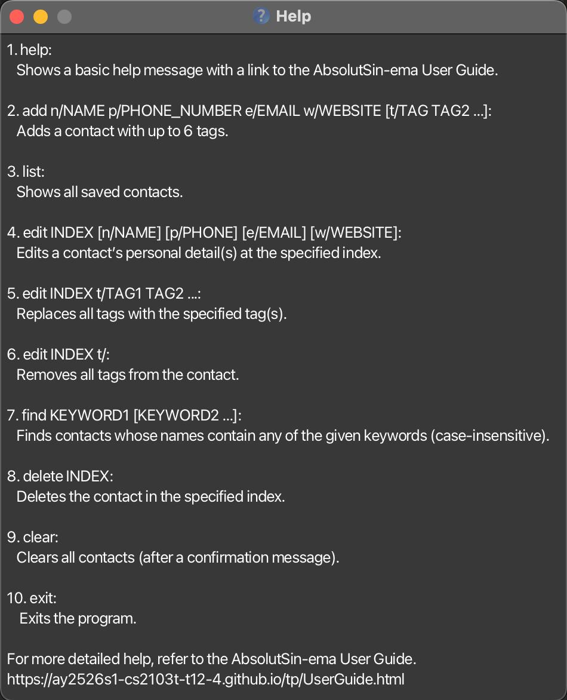

<<<<<<< HEAD
**AbsolutSin-ema** is a **desktop app for managing contacts, optimized for use via a Command Line Interface** (CLI) while still having the benefits of a Graphical User Interface (GUI). If you can type fast, AbsolutSin-ema can get your contact management tasks done faster than traditional GUI apps.
=======
AbsolutSin-ema is a **desktop app for managing contacts, optimized for use via a Command Line Interface** (CLI) while still having the benefits of a Graphical User Interface (GUI). If you can type fast, AbsolutSin-ema can get your contact management tasks done faster than traditional GUI apps.
>>>>>>> 96bfb200 (Edit userguide to match MVP)

* Table of Contents
{:toc}

--------------------------------------------------------------------------------------------------------------------

## Quick start

1. Ensure you have Java `17` or above installed on your computer.
   - **Mac users:** Ensure you have the precise JDK version prescribed [here](https://se-education.org/guides/tutorials/javaInstallationMac.html).
   - **Windows/Linux users:** You can download Java from the [official Oracle website](https://www.oracle.com/java/technologies/downloads/).

2. Download the latest `absolutsin-ema.jar` file from [here](https://github.com/AY2425S1-CS2103T-F12-4/tp/releases).

<<<<<<< HEAD
3. Copy the file to the folder you want to use as the _home folder_ for AbsolutSin-ema.

4. Open a command terminal, `cd` into the folder you put the jar file in, and use the `java -jar absolutsin-ema.jar` command to run the application.
   A GUI similar to the below should appear in a few seconds. Note how the app contains some sample data.
   
=======
1. Copy the file to the folder you want to use as the _home folder_ for your AbsolutSin-ema.

1. Open a command terminal, `cd` into the folder you put the jar file in, and use the `java -jar absolutsinema.jar` command to run the application. 
   A GUI similar to the below should appear in a few seconds. Note how the app contains some sample data. 
>>>>>>> 96bfb200 (Edit userguide to match MVP)
   
   
   
:information_source: **Note:** If the application doesn't start, ensure that you have the correct Java version installed and that the jar file is not corrupted. See the [Troubleshooting](#troubleshooting) section for more help.

5. Type the command in the command box and press Enter to execute it. For example, typing **`help`** and pressing Enter will open the help window.
   Some example commands you can try:

   * `list` : Lists all contacts.

<<<<<<< HEAD
   * `add n/John Doe p/98765432 e/johnd@example.com a/John street, block 123, #01-01` : Adds a contact named `John Doe` to AbsolutSin-ema.
=======
   * `add n/John Doe p/98765432 e/johnd@example.com w/johndoe.com` : Adds a contact named `John Doe` to the AbsolutSin-ema.
>>>>>>> 96bfb200 (Edit userguide to match MVP)

   * `delete 3` : Deletes the 3rd contact shown in the current list.

   * `clear` : Deletes all contacts.

   * `exit` : Exits the app.

6. Refer to the [Features](#features) below for details of each command.

--------------------------------------------------------------------------------------------------------------------

## Features

**:information_source: Notes about the command format:**

* **Parameters:** Words in `UPPER_CASE` are the parameters to be supplied by the user.
  e.g. in `add n/NAME`, `NAME` is a parameter which can be used as `add n/John Doe`.

* **Optional parameters:** Items in square brackets are optional.
  e.g `n/NAME [t/TAG]` can be used as `n/John Doe t/friend` or as `n/John Doe`.

<<<<<<< HEAD
* **Multiple parameters:** Items with `…` after them can be used multiple times including zero times.
  e.g. `[t/TAG]…` can be used as ` ` (i.e. 0 times), `t/friend`, `t/friend t/family` etc.
=======
* Items with `…`​ after them can be used multiple times including zero times. 
  e.g. `[t/TAG]…​` can be used as ` ` (i.e. 0 times), `t/friend`, `t/friend t/family` etc.
>>>>>>> 96bfb200 (Edit userguide to match MVP)

* **Parameter order:** Parameters can be in any order.
  e.g. if the command specifies `n/NAME p/PHONE_NUMBER`, `p/PHONE_NUMBER n/NAME` is also acceptable.

* **Extra parameters:** Extraneous parameters for commands that do not take in parameters (such as `help`, `list`, `exit` and `clear`) will be ignored.
  e.g. if the command specifies `help 123`, it will be interpreted as `help`.

* **Index requirements:** When a command requires an `INDEX`, it must be a positive integer (1, 2, 3, ...) and must not exceed the number of persons currently displayed.

* **Case sensitivity:** All commands are case-sensitive. Use lowercase for command words (e.g., `add`, `delete`, `edit`).

* **Copy-paste warning:** If you are using a PDF version of this document, be careful when copying and pasting commands that span multiple lines as space characters surrounding line-breaks may be omitted when copied over to the application.

### Viewing help : `help`

Shows a message explaining how to access the help page. This opens a pop-up window with a link to this User Guide.

Format: `help`

:bulb: **Tip:**
You can also press `F1` or use the Help menu to access the help window.

### Adding a person: `add`

<<<<<<< HEAD
Adds a person to AbsolutSin-ema.

Format: `add n/NAME p/PHONE_NUMBER e/EMAIL a/ADDRESS [t/TAG]…`
=======
Adds a person to the AbsolutSin-ema.

Format: `add n/NAME p/PHONE_NUMBER e/EMAIL w/WEBSITE [t/TAG]…​`
>>>>>>> 96bfb200 (Edit userguide to match MVP)

:information_source: **Note:**
All fields except tags are mandatory. You must provide name, phone number, email, and address when adding a contact.

<<<<<<< HEAD

:bulb: **Tip:**
A person can have any number of tags (including 0). Tags are useful for categorizing contacts (e.g., friends, colleagues, family).

**Parameter requirements (all mandatory except tags):**
* `NAME` *(required)*: Can contain letters, numbers, and spaces. Cannot be empty or start with a space.
* `PHONE_NUMBER` *(required)*: Should contain only numbers. Must be at least 3 digits long. No spaces, dashes, or special characters (including `+`) are allowed.
* `EMAIL` *(required)*: Must be a valid email format (e.g., user@domain.com).
* `ADDRESS` *(required)*: Can contain any characters. Cannot be empty or start with whitespace.
* `TAG` *(optional)*: Can contain letters and numbers only. No spaces, special characters, or punctuation allowed in tags.

**Examples:**
* `add n/John Doe p/98765432 e/johnd@example.com a/John street, block 123, #01-01`
* `add n/Betsy Crowe t/friend e/betsycrowe@example.com a/Newgate Prison p/1234567 t/criminal`
* `add n/Alex Tan p/6591234567 e/alex.tan@gmail.com a/Blk 456, Orchard Road, #12-34 t/colleague t/projectmanager`

### Listing all persons : `list`

Shows a list of all persons in AbsolutSin-ema. This command displays all contacts in the order they were added, with their complete information including name, phone, email, address, and tags.
=======
Examples:
* `add n/John Doe p/98765432 e/johnd@example.com w/johndoe.com`
* `add n/Betsy Crowe t/friend e/betsycrowe@example.com w/betsycrowe.com p/1234567 t/criminal`

### Listing all persons : `list`

Shows a list of all persons in the AbsolutSin-ema.
>>>>>>> 96bfb200 (Edit userguide to match MVP)

Format: `list`

:information_source: **Note:**
The `list` command will show all contacts even if you have previously filtered the list using the `find` command.

### Editing a person : `edit`

<<<<<<< HEAD
Edits an existing person in AbsolutSin-ema. You can modify any combination of the person's details.

Format: `edit INDEX [n/NAME] [p/PHONE] [e/EMAIL] [a/ADDRESS] [t/TAG]…`
=======
Edits an existing person in the AbsolutSin-ema.

Format: `edit INDEX [n/NAME] [p/PHONE] [e/EMAIL] [w/WEBSITE] [t/TAG]…​`
>>>>>>> 96bfb200 (Edit userguide to match MVP)

**How it works:**
* Edits the person at the specified `INDEX`. The index refers to the index number shown in the displayed person list. The index **must be a positive integer** 1, 2, 3, …
* At least one of the optional fields must be provided.
* Existing values will be updated to the input values.
* When editing tags, the existing tags of the person will be removed i.e adding of tags is not cumulative.
* You can remove all the person's tags by typing `t/` without specifying any tags after it.

<<<<<<< HEAD

:exclamation: **Important:**
Tag editing replaces ALL existing tags. To keep existing tags, you must include them in the edit command.

**Examples:**
*  `edit 1 p/91234567 e/johndoe@example.com` Edits the phone number and email address of the 1st person to be `91234567` and `johndoe@example.com` respectively.
=======
Examples:
*  `edit 1 p/91234567 e/johndoe@example.com w/johndoe.com` Edits the phone number, email and website of the 1st person to be `91234567`, `johndoe@example.com` and `johndoe.com` respectively.
>>>>>>> 96bfb200 (Edit userguide to match MVP)
*  `edit 2 n/Betsy Crower t/` Edits the name of the 2nd person to be `Betsy Crower` and clears all existing tags.
*  `edit 3 t/friend t/colleague` Replaces all existing tags of the 3rd person with `friend` and `colleague`.

### Locating persons by name: `find`

Finds persons whose names contain any of the given keywords. This helps you quickly locate specific contacts when your contact list is large.

Format: `find KEYWORD [MORE_KEYWORDS]`

**Search behavior:**
* The search is case-insensitive. e.g `hans` will match `Hans`
* The order of the keywords does not matter. e.g. `Hans Bo` will match `Bo Hans`
* Only the name field is searched (not phone, email, address, or tags).
* Only full words will be matched e.g. `Han` will not match `Hans`
* Uses word boundary matching - keywords must match complete words in the name
* Persons matching at least one keyword will be returned (i.e. `OR` search).
  e.g. `Hans Bo` will return `Hans Gruber`, `Bo Yang`

:information_source: **Note:**
After using `find`, you can use `list` to see all contacts again.

**Examples:**
* `find John` returns `john` and `John Doe`
<<<<<<< HEAD
* `find alex david` returns `Alex Yeoh`, `David Li`
  
  
  
* `find tan` returns `Alex Tan`, `Tan Wei Ming`, `Cheng Tan`

### Deleting a person : `delete`

Deletes the specified person from AbsolutSin-ema permanently. This action cannot be undone.
=======
* `find alex` returns `Alex Yeoh` 
  

### Searching by tags: Search Bar

In addition to the `find` command, you can also use the search bar at the top of the application to filter contacts by tags.

*   To search for a specific tag, simply type the tag name in the search bar. For example, typing `friend` will show all contacts with the `friend` tag.
*   The search is case-insensitive.
*   You can search for multiple tags by separating them with spaces. For example, typing `friend family` will show contacts that have either the `friend` tag or the `family` tag (i.e. `OR` search).
*   To clear the search filter, simply clear the text in the search bar.

This provides a quick and easy way to filter your contacts without using commands.

### Deleting a person : `delete`

Deletes the specified person from the AbsolutSin-ema.
>>>>>>> 96bfb200 (Edit userguide to match MVP)

Format: `delete INDEX`

**How it works:**
* Deletes the person at the specified `INDEX`.
* The index refers to the index number shown in the displayed person list.
* The index **must be a positive integer** 1, 2, 3, …

<<<<<<< HEAD

:exclamation: **Warning:**
This action is permanent and cannot be undone. Make sure you delete the correct person!

**Examples:**
* `list` followed by `delete 2` deletes the 2nd person in AbsolutSin-ema.
=======
Examples:
* `list` followed by `delete 2` deletes the 2nd person in the AbsolutSin-ema.
>>>>>>> 96bfb200 (Edit userguide to match MVP)
* `find Betsy` followed by `delete 1` deletes the 1st person in the results of the `find` command.
* `delete 5` deletes the 5th person shown in the current list.

### Clearing all entries : `clear`

<<<<<<< HEAD
Clears all entries from AbsolutSin-ema. This removes every contact permanently.
=======
Clears all entries from the AbsolutSin-ema.
>>>>>>> 96bfb200 (Edit userguide to match MVP)

Format: `clear`

:exclamation: **Danger:**
This will delete ALL contacts permanently and cannot be undone. Use with extreme caution!

### Exiting the program : `exit`

Exits the program. All data is automatically saved before the program closes.

Format: `exit`

:information_source: **Note:**
You can also close the program by clicking the X button on the window or pressing `Alt+F4` (Windows/Linux) or `Cmd+Q` (Mac).

### Saving the data

<<<<<<< HEAD
AbsolutSin-ema data are saved to the hard disk automatically after any command that changes the data. There is no need to save manually.

:information_source: **Auto-save:**
Your data is automatically saved after every add, edit, delete, or clear command. You never have to worry about losing your data!

### Editing the data file

<<<<<<< HEAD
AbsolutSin-ema data are saved automatically as a JSON file `[JAR file location]/data/addressbook.json`. Advanced users are welcome to update data directly by editing that data file.

:exclamation: **Caution:**
Direct file editing is for advanced users only. If your changes make the file format invalid, AbsolutSin-ema will discard all data and start with an empty data file at the next run. Hence, it is **strongly recommended** to take a backup of the file before editing it.

Furthermore, certain edits can cause AbsolutSin-ema to behave in unexpected ways (e.g., if a value entered is outside of the acceptable range). Therefore, edit the data file only if you are confident that you can update it correctly.
=======
AbsolutSin-ema data are saved in the hard disk automatically after any command that changes the data. There is no need to save manually.

### Editing the data file

AbsolutSin-ema data are saved automatically as a JSON file `[JAR file location]/data/absolutsinema.json`. Advanced users are welcome to update data directly by editing that data file.

:exclamation: **Caution:**
If your changes to the data file makes its format invalid, AbsolutSin-ema will discard all data and start with an empty data file at the next run. Hence, it is recommended to take a backup of the file before editing it. 
Furthermore, certain edits can cause the AbsolutSin-ema to behave in unexpected ways (e.g., if a value entered is outside of the acceptable range). Therefore, edit the data file only if you are confident that you can update it correctly.
>>>>>>> 96bfb200 (Edit userguide to match MVP)
=======
AbsoluteSin-Ema data are saved automatically as a JSON file `[JAR file location]/data/absolutsinema `. Advanced users are welcome to update data directly by editing that data file.

:exclamation: **Caution:**
If your changes to the data file makes its format invalid, AbsoluteSin-Ema will discard all data and start with an empty data file at the next run. Hence, it is recommended to take a backup of the file before editing it. 
Furthermore, certain edits can cause the AbsoluteSin-Ema to behave in unexpected ways (e.g., if a value entered is outside of the acceptable range). Therefore, edit the data file only if you are confident that you can update it correctly.
>>>>>>> d6fead65 (Update the name of the app)

**File location:** The data file is located at `[JAR file location]/data/addressbook.json` on all platforms (Windows, Mac, and Linux).

### Archiving data files `[coming in v2.0]`

_Details coming soon ..._

--------------------------------------------------------------------------------------------------------------------

## FAQ

<<<<<<< HEAD
**Q**: How do I transfer my data to another computer? 
**A**: Install AbsolutSin-ema on the new computer and overwrite the empty data file it creates with the file that contains the data of your previous AbsolutSin-ema home folder. The data file is located at `[JAR file location]/data/addressbook.json`.

**Q**: What happens if I accidentally delete a contact? 
**A**: Unfortunately, there is no undo feature. The contact will be permanently deleted. You will need to add the contact again manually. Consider making regular backups of your data file to prevent data loss.

**Q**: Why can't I find a contact even though I know they exist? 
**A**: The `find` command only searches by name and requires exact word matches. Make sure you're typing the exact words that appear in the contact's name. Use `list` to see all contacts if needed.

**Q**: Can I have two contacts with the same name? 
**A**: No, AbsolutSin-ema does not allow duplicate names. Each contact must have a unique name. If you try to add a contact with an existing name, you will get an error message.

**Q**: What should I do if the application won't start? 
**A**: Ensure you have Java 17 or above installed. Check that the jar file is not corrupted by re-downloading it. Make sure you're running the command `java -jar absolutsin-ema.jar` from the correct directory. See the [Troubleshooting](#troubleshooting) section for more detailed steps.

**Q**: Can I backup my data? 
**A**: Yes, simply copy the `addressbook.json` file from the data folder to a safe location. You can restore it later by copying it back. It's recommended to backup your data regularly.

**Q**: Are my contacts searchable by phone number or email? 
**A**: Currently, the `find` command only searches by name. To find contacts by other fields, use the `list` command to view all contacts and manually search through them.

**Q**: What characters are allowed in names and addresses? 
**A**: Names can contain letters, numbers, and spaces. Addresses can contain any characters including special symbols, making them flexible for international addresses.
=======
**Q**: How do I transfer my data to another Computer? 
**A**: Install the app in the other computer and overwrite the empty data file it creates with the file that contains the data of your previous AbsolutSin-ema home folder.
>>>>>>> 96bfb200 (Edit userguide to match MVP)

--------------------------------------------------------------------------------------------------------------------

## Known issues

1. **When using multiple screens**, if you move the application to a secondary screen, and later switch to using only the primary screen, the GUI will open off-screen. The remedy is to delete the `preferences.json` file created by the application before running the application again.

2. **If you minimize the Help Window** and then run the `help` command (or use the `Help` menu, or the keyboard shortcut `F1`) again, the original Help Window will remain minimized, and no new Help Window will appear. The remedy is to manually restore the minimized Help Window.

3. **Long contact names or addresses** may be truncated in the display. The full information is still stored and can be viewed by expanding the window or editing the contact.

4. **Special characters in names** (like accented letters or symbols) are supported but may display differently depending on your system's font settings.

5. **Very large contact lists** (1000+ contacts) may cause slower performance when searching or scrolling through the list.

6. **Duplicate detection**: The application prevents adding contacts with the same name. Duplicate detection is based solely on the name field - two contacts with identical names but different phone numbers, emails, or addresses will still be considered duplicates.

--------------------------------------------------------------------------------------------------------------------

## Troubleshooting

**Application won't start:**
- Verify Java 17+ is installed: run `java -version` in terminal
- Ensure the jar file is in the correct location
- Check that you have read/write permissions in the directory
- Try running from a different directory or re-downloading the jar file
- Check that no other instance of the application is already running

**Data not saving:**
- Ensure you have write permissions in the application directory
- Check that there's sufficient disk space
- Verify the data folder exists and is accessible
- Check if the `addressbook.json` file is read-only

**Commands not working:**
- Check command syntax against the examples in this guide
- Ensure you're using the correct prefixes (n/, p/, e/, a/, t/)
- Verify that required parameters are provided
- Ensure there are no typos in command words (all commands must be lowercase)
- Check that INDEX values are positive integers within the valid range

**Performance issues:**
- Try closing and reopening the application
- Ensure you have sufficient system memory
- Consider archiving old contacts if you have a very large list
- Close other resource-intensive applications

**Display issues:**
- If text appears truncated, try resizing the window
- If the application appears off-screen, delete the `preferences.json` file
- Ensure your display scaling is set to 100% or 125% for optimal appearance

**Data file corruption:**
- If you see an error about corrupted data, restore from your backup
- If no backup exists, the application will start with an empty contact list
- Contact details that caused corruption will need to be re-entered manually

--------------------------------------------------------------------------------------------------------------------

## Command summary

<<<<<<< HEAD
| Action | Format and Examples |
|--------|---------------------|
| **Add** | `add n/NAME p/PHONE_NUMBER e/EMAIL a/ADDRESS [t/TAG]…`   e.g., `add n/James Ho p/22224444 e/jamesho@example.com a/123, Clementi Rd, 1234665 t/friend t/colleague` |
| **Clear** | `clear` |
| **Delete** | `delete INDEX`   e.g., `delete 3` |
| **Edit** | `edit INDEX [n/NAME] [p/PHONE_NUMBER] [e/EMAIL] [a/ADDRESS] [t/TAG]…`   e.g., `edit 2 n/James Lee e/jameslee@example.com` |
| **Exit** | `exit` |
| **Find** | `find KEYWORD [MORE_KEYWORDS]`   e.g., `find James Jake` |
| **Help** | `help` |
| **List** | `list` |

--------------------------------------------------------------------------------------------------------------------

## Glossary

* **CLI (Command Line Interface)**: A text-based interface where you type commands to interact with the application.
* **GUI (Graphical User Interface)**: A visual interface with windows, buttons, and other graphical elements.
* **INDEX**: The number shown beside each contact in the displayed list, used to reference specific contacts in commands.
* **JAR file**: Java Archive file, the executable file format for Java applications.
* **JSON**: JavaScript Object Notation, the file format used to store your contact data.
* **Parameter**: A piece of information you provide to a command (e.g., name, phone number).
* **Tag**: A label you can attach to contacts for categorization (e.g., friend, colleague).

--------------------------------------------------------------------------------------------------------------------
=======
Action | Format, Examples
--------|------------------
**Add** | `add n/NAME p/PHONE_NUMBER e/EMAIL w/WEBSITE [t/TAG]…​`   e.g., `add n/James Ho p/22224444 e/jamesho@example.com w/jamesho.com t/friend t/colleague`
**Clear** | `clear`
**Delete** | `delete INDEX`  e.g., `delete 3`
**Edit** | `edit INDEX [n/NAME] [p/PHONE_NUMBER] [e/EMAIL] [w/WEBSITE] [t/TAG]…​`  e.g.,`edit 2 n/James Lee e/jameslee@example.com`
**Find** | `find KEYWORD [MORE_KEYWORDS]`  e.g., `find James Jake`
**List** | `list`
**Help** | `help`
<<<<<<< HEAD
>>>>>>> 96bfb200 (Edit userguide to match MVP)
=======
>>>>>>> 548c188a (Fix ubuntu error)
