AbsolutSin-ema is an address book that is designed as a **desktop app for managing contacts, optimized for use via a Command Line Interface** (CLI) while still having the benefits of a Graphical User Interface (GUI). If you can type fast, AbsolutSin-ema can get your contact management tasks done faster than traditional GUI apps.

AbsolutSin-ema is designed for **party planners who manage multiple contacts and events**:

**👥 Target Users:**
- **Student organizers**: Managing dorm parties, graduation events (20-100 guests)
- **Corporate event coordinators**: Handling company parties, team building events (50-500 attendees)
- **Freelance party planners**: Organizing weddings, birthdays, celebrations for clients
- **Venue managers**: Coordinating multiple events with vendors/contacts/people and suppliers

**⚡ Perfect for planners who:**
- Need to **quickly find vendor/contacts** during event setup
- Manage **budgets across multiple suppliers** (catering, DJ, decorations)
- **Type faster than they click** and prefer keyboard shortcuts
- Handle **20+ contacts per event** and want instant access
- Value **organized, searchable contact databases** over phone scrolling

📝 Note on Terminology:

In AbsolutSin-ema, **"vendor"**, **"contact"**, **"person"**, and **"supplier"** all refer to the same thing - the people/businesses you work with for events. Whether it's a DJ, caterer, florist, or guest, they're all stored as "contacts" in the system.

- When we say "add a vendor" → you use the `add` command to add a contact
- "Assign vendors to party" → you're assigning contacts to the party
- Your "contact list" contains all your vendors, suppliers, and any other people

Think of it as your universal party planning address book! 📞

## 🚀 Why CLI for Party Planning?

**Speed Where It Matters:**
- **Find DJ contact in 2 seconds** instead of scrolling through phone during setup crisis
- **Add 10 vendors in 30 seconds** vs minutes of form clicking
- **Bulk assign contacts to parties** with single commands

**Real Scenarios:**
- *"The caterer is late, I need the backup contact NOW"* → `find catering backup` ⚡
- *"Add all these business cards from the vendor fair"* → Rapid `add` commands
- *"Check if we're over budget for decorations"* → `view party_index` shows remaining budget instantly

**vs Traditional Apps:**
- 📱 **Phone contacts**: Scroll, scroll, scroll... *"Was it under DJ or Music?"*
- 🖱️ **GUI contact apps**: Click New → Fill form → Click Save → Repeat 20 times
- ⌨️ **AbsolutSin-ema**: `add n/DJ Mike p/91234567 e/mike@music.com b/800` → Done!

## Table of Contents

* [Quick start](#quick-start)
* [Features](#features)
    * [Viewing help](#viewing-help-help)
    * [Adding a person](#adding-a-person-add)
    * [Listing all persons](#listing-all-persons-list)
    * [Editing a person](#editing-a-person-edit)
    * [Locating persons by name](#locating-persons-by-name-find)
    * [Listing all tags](#listing-all-tags-listtags)
    * [Deleting a person](#deleting-a-person-delete)
    * [Managing parties](#managing-parties)
        * [Adding a party](#adding-a-party-addp)
        * [Editing a party](#editing-a-party-editp)
        * [Deleting a party](#deleting-a-party-deletep)
        * [Assigning contacts to a party](#assigning-contacts-to-a-party-assign)
        * [Unassigning contacts from a party](#unassigning-contacts-from-a-party-unassign)
        * [Viewing party participants](#viewing-party-participants-view)
    * [Clearing all entries](#clearing-all-entries-clear)
    * [Undoing the previous command](#undoing-the-previous-command-undo)
    * [Exiting the program](#exiting-the-program-exit)
    * [Saving the data](#saving-the-data)
    * [Editing the data file](#editing-the-data-file)
* [FAQ](#faq)
* [Known issues](#known-issues)
* [Command summary](#command-summary)

--------------------------------------------------------------------------------------------------------------------

## Quick start

1. Ensure you have Java `17` or above installed in your Computer. 
   **Mac users:** Ensure you have the precise JDK version prescribed [here](https://se-education.org/guides/tutorials/javaInstallationMac.html).

1. Download the latest `.jar` file from [here](https://github.com/se-edu/addressbook-level3/releases).

1. Copy the file to the folder you want to use as the _home folder_ for your AbsolutSin-ema.

1. Open a command terminal, `cd` into the folder you put the jar file in, and use the `java -jar absolutsinema.jar` command to run the application. 
   A GUI similar to the below should appear in a few seconds. Note how the app contains some sample data. 
   

5. Type the command in the command box and press Enter to execute it. For example, typing **`help`** and pressing Enter will open the help window.

### 🎉 5-Minute Party Planning Tutorial

Let's plan Sarah's Birthday Party to see AbsolutSin-ema in action:

   **Step 1: Add your vendors**
   * `add n/DJ Mike p/91234567 e/mike@music.com b/800 t/dj` : Add the DJ
   * `add n/Bella's Catering p/87654321 e/orders@bella.com b/1200 t/catering` : Add catering service
   * `add n/Party Supplies Plus p/76543210 e/info@partysupplies.com b/300 t/decorations` : Add decorations vendor

   **Step 2: Create the party**
   * `addp n/Sarah's Birthday d/25-12-2024 t/19:00 b/2500 c/1,2,3` : Create party and assign all vendors

   **Step 3: Check your planning**
   * `view 1` : See who's assigned and remaining budget
   * `list` : View all your contacts
   * `find dj` : Quickly find DJ contacts when needed

   **Other useful commands:**
   * `undo` : Undoes the most recent add, delete, edit, or clear command
   * `editp 1 b/3000` : Increase party budget if needed
   * `assign 1 c/4` : Add more vendors to the party
   * `exit` : Exits the app

1. Refer to the [Features](#features) below for details of each command.

--------------------------------------------------------------------------------------------------------------------

## Features

### ℹ️ Notes about the command format: 

* Words in `UPPER_CASE` are the parameters to be supplied by the user. 
  e.g. in `add n/NAME`, `NAME` is a parameter which can be used as `add n/John Doe`.

* Items in square brackets are optional. 
  e.g `n/NAME [t/TAG]` can be used as `n/John Doe t/friend` or as `n/John Doe`.

* Items with `…`​ after them can be used multiple times including zero times. 
  e.g. `[t/TAG]…​` can be used as ` ` (i.e. 0 times), `t/friend`, `t/friend t/family` etc.

* Parameters can be in any order. 
  e.g. if the command specifies `n/NAME p/PHONE_NUMBER`, `p/PHONE_NUMBER n/NAME` is also acceptable.

* Extraneous parameters for commands that do not take in parameters (such as `help`, `list`, `exit`) will be ignored. 
  e.g. if the command specifies `help 123`, it will be interpreted as `help`.

* If you are using a PDF version of this document, be careful when copying and pasting commands that span multiple lines as space characters surrounding line-breaks may be omitted when copied over to the application.

* **Case sensitivity**: Contact names and party names are case-insensitive. `John Doe`, `john doe`, and `JOHN DOE` are treated as the same name.

* **Parameter restrictions**: All parameters cannot contain spaces **except for names**. For example:
  * ✅ Valid: `n/John Doe` (names can have spaces)
  * ✅ Valid: `p/91234567`, `e/john@example.com`, `w/www.example.com`
  * ❌ Invalid: `p/9123 4567`, `e/john @example.com`, `w/www.example .com`

### Viewing help: `help`

Shows a message explaining how to access the help page.

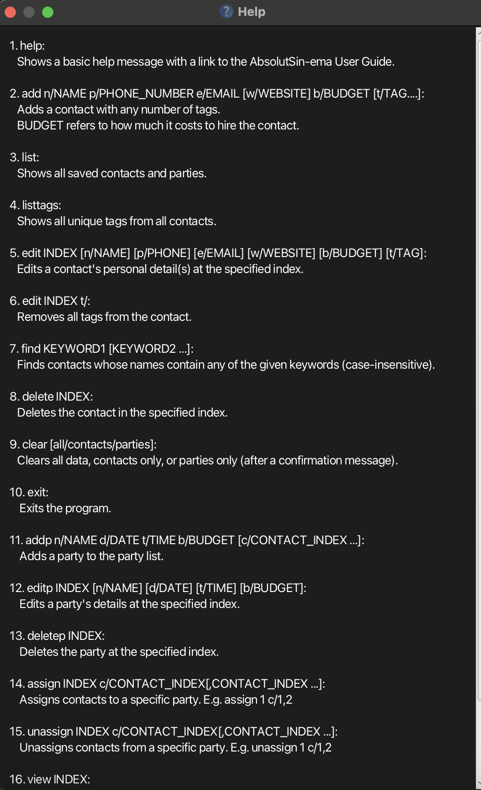

Format: `help`

### Adding a person: `add`

Adds a person to the AbsolutSin-ema.

Format: `add n/NAME p/PHONE_NUMBER e/EMAIL b/BUDGET [w/WEBSITE] [t/TAG]…​`

 💡 Tip:
A person can have any number of tags (including 0)
Additionally, budget refers to the cost of hiring this contact and should only contain up to 7 digits with up to 2 decimal places

Examples:
* `add n/John Doe p/98765432 e/johnd@example.com w/johndoe.com b/100`
* `add n/Betsy Crowe t/friend e/betsycrowe@example.com w/betsycrowe.com p/1234567 b/250 t/photographer`

### Listing all persons: `list`

Shows a list of all persons in the AbsolutSin-ema.

Format: `list`

### Editing a person: `edit`

Edits an existing person in the AbsolutSin-ema.

Format: `edit INDEX [n/NAME] [p/PHONE] [e/EMAIL] [w/WEBSITE] [b/BUDGET] [t/TAG]…`

* Edits the person at the specified `INDEX`. The index refers to the index number shown in the displayed person list. The index **must be a positive integer** 1, 2, 3, …​
* At least one of the optional fields must be provided.
* Existing values will be updated to the input values.
* Budget should only contain up to 7 digits with up to 2 decimal places.
* **Budget constraint:** If editing a contact's budget would cause the total cost of assignees to exceed the budget of any party the contact is assigned to, an error will be returned and the edit will not proceed.
* When editing tags, the **existing tags of the person will be removed** i.e. adding of tags is not cumulative.
* By typing `t/` without specifying any tags after it, you remove all tags of the contact.

Examples:
*  `edit 1 p/91234567 e/johndoe@example.com w/johndoe.com b/120` Edits the phone number, email, website, and budget of the 1st person to be `91234567`, `johndoe@example.com`, `johndoe.com`, and `120` respectively.
*  `edit 2 n/Betsy Crower t/` Edits the name of the 2nd person to be `Betsy Crower` and clears all existing tags.

### Locating persons by name: `find`

Finds persons whose names contain any of the given keywords.

Format: `find KEYWORD [MORE_KEYWORDS]`

* **Note:** Spaces separate different keywords. Each space-separated word is treated as an individual search term.
* The search is **case-insensitive**. e.g `hans` will match `Hans`, `HANS`, or `hans`
* The order of the keywords does not matter. e.g. `Hans Bo` will match `Bo Hans`
* Full words are not needed to find a match e.g. `Han` will match `Hans`
* Persons matching at least one keyword will be returned (i.e. `OR` search).
  e.g. `Hans Bo` will return `Hans Gruber`, `Bo Yang`
* You can also **search by tags** in addition to names.  
  e.g. `find friend` will return all persons tagged as “friend”.

Examples:
* `find John` returns `john` and `John Doe`
* `find alex` returns `Alex Yeoh` 
* `find friend` returns all persons with the tag `friend`.
* `find alex friend` returns all persons whose name includes "Alex" or who have the tag "friend".
  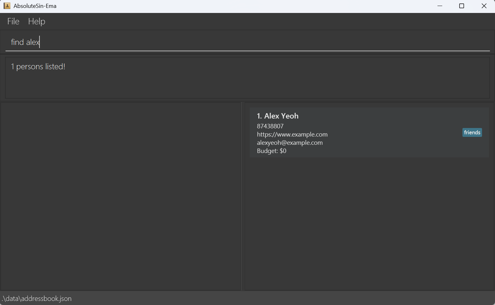

### Listing all tags: `listtags`

Lists all tags currently used in the AbsolutSin-ema.

Format: `listtags`

* The command displays all unique tags across all persons in alphabetical order.
* If no tags exist in the address book, a message will indicate that no tags were found.

Example:
* `listtags` displays all tags such as `colleague`, `friend`, `supplier`, etc.
  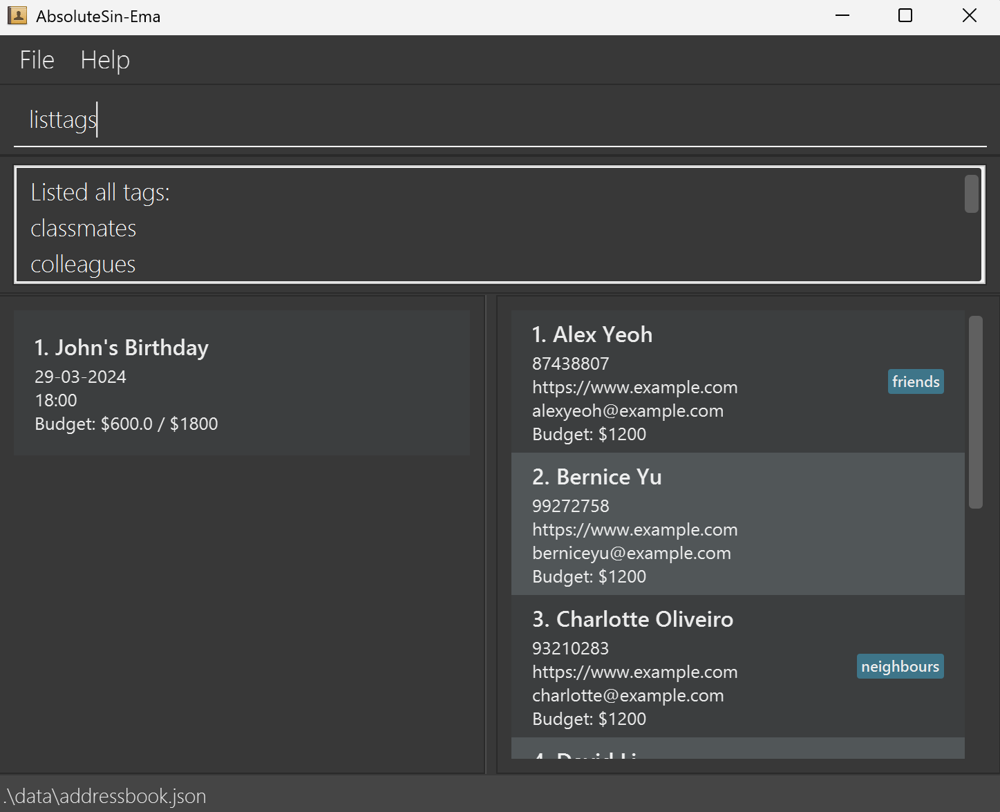

### Deleting a person: `delete`

Deletes the specified person from the AbsolutSin-ema.

Format: `delete INDEX`

* Deletes the person at the specified `INDEX`.
* The index refers to the index number shown in the displayed person list.
* The index **must be a positive integer** 1, 2, 3, …​

Examples:
* `list` followed by `delete 2` deletes the 2nd person in the AbsolutSin-ema.
* `find Betsy` followed by `delete 1` deletes the 1st person in the results of the `find` command.

### Managing parties

AbsolutSin-ema allows you to manage parties (events) and assign contacts to them.

### Adding a party: `addp`
Adds a party to the party list.

Format: `addp n/NAME d/DATE t/TIME b/BUDGET [c/CONTACT_INDEX ...]`

* You may optionally assign contacts to the party using their indexes.
* **Important:** A contact cannot be assigned to multiple parties that occur at the same date and time.
* **Budget constraint:** If assigning contacts would cause the total cost of all assignees to exceed the party's budget, an error will be returned.
* The date must be in the format `DD-MM-YYYY` (e.g. `25-12-2024`) and cannot be before today.
* The time must be in the format `HH:mm` (e.g. `18:00`).
* Budget should only contain up to 7 digits with up to 2 decimal places.

Examples:
* `addp n/John's Birthday d/12-12-2025 t/18:00 b/5000`
* `addp n/Team Meeting d/01-11-2025 t/14:00 b/2000 c/1,2`

  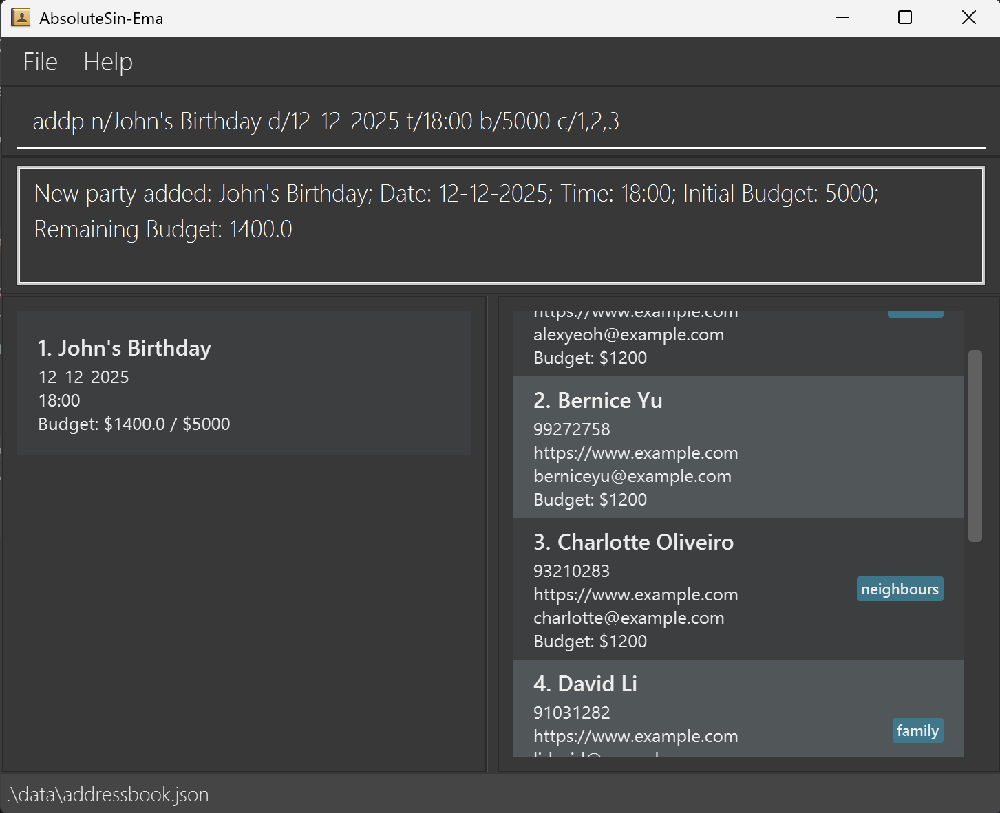

### Editing a party: `editp`
Edits the details of an existing party.

Format: `editp INDEX [n/NAME] [d/DATE] [t/TIME] [b/BUDGET]`

* Edits the party at the specified `INDEX` in the party list.
* At least one of the optional fields must be provided.
* Budget should only contain up to 7 digits with up to 2 decimal places.

🚧 If the party has already passed, it **cannot be editted**, unless it's date is reassigned to the present/future first.

Examples:
* `editp 1 d/13-12-2025 t/20:00 b/5100`
* `editp 2 t/15:00`

  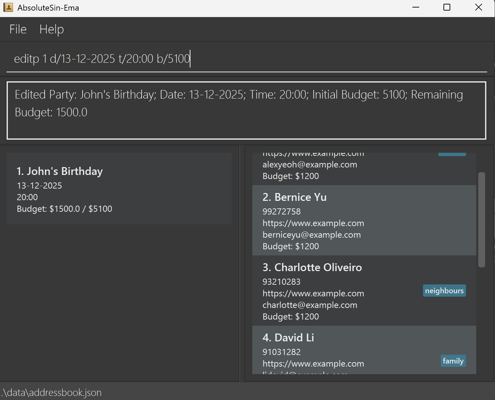

### Deleting a party: `deletep`
Deletes a party from the party list.

Format: `deletep INDEX`

* Deletes the party at the specified `INDEX` in the party list.

Example:
* `deletep 1`

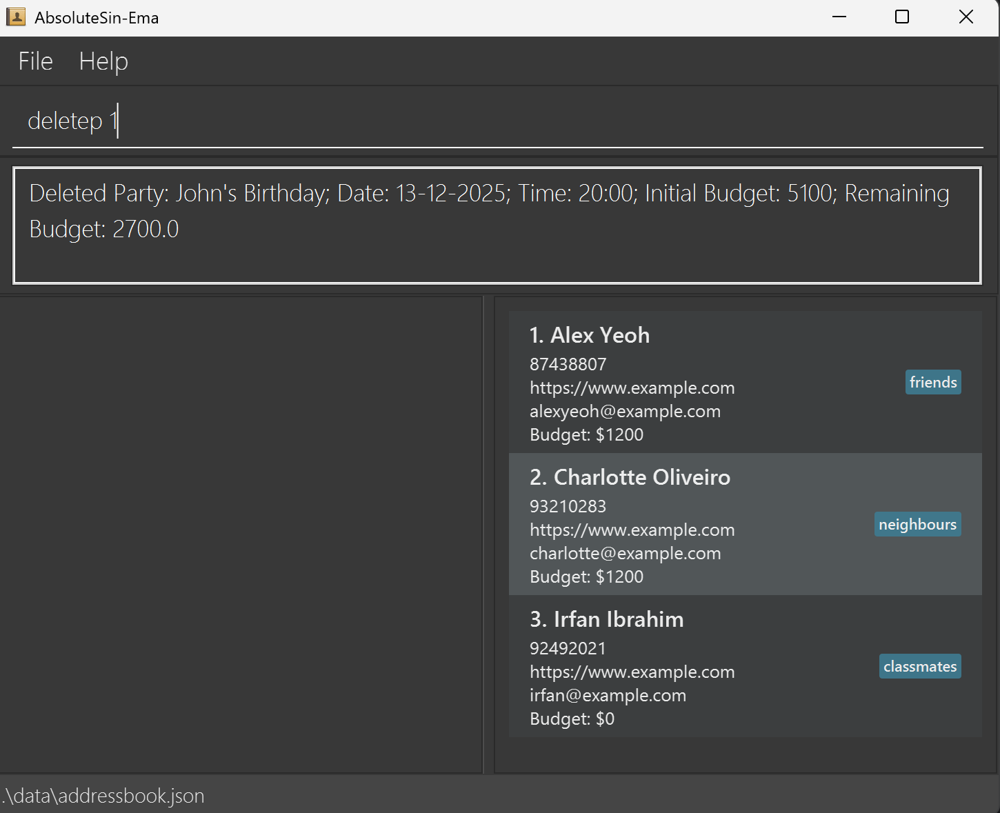

### Assigning contacts to a party: `assign`
Assigns contacts to a specific party.

Format: `assign INDEX c/CONTACT_INDEX[,CONTACT_INDEX ...]`

* Assigns the specified contacts to the party at the given `INDEX`.
* With each contact added, the budget of the party will be updated.
* **Important:** You cannot assign the same person to multiple parties that occur at the same date and time. Each person can only be assigned to one party per time slot.
* **Budget constraint:** If assigning contacts would cause the total cost of all assignees to exceed the party's budget, an error will be returned and the assignment will not proceed.

Example:
* `assign 1 c/5`

  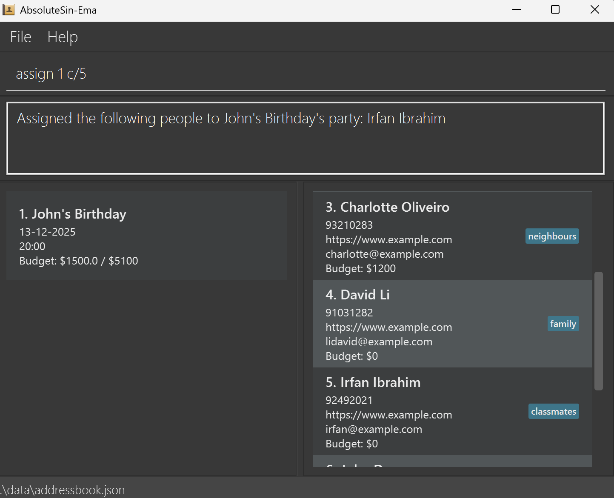

### Unassigning contacts from a party: `unassign`
Unassigns contacts from a specific party.

Format: `unassign INDEX c/CONTACT_INDEX[,CONTACT_INDEX ...]`

* Unassigns the specified contacts from the party at the given `INDEX`.

Example:
* `unassign 1 c/2`

  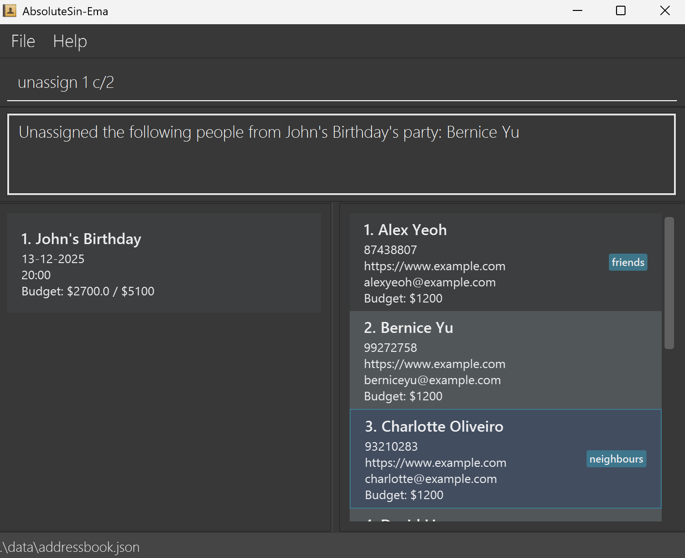

### Viewing party participants: `view`
Shows all contacts assigned to a party.

Format: `view INDEX`

* Displays all contacts assigned to the party at the specified `INDEX`.

Example:
* `view 1`

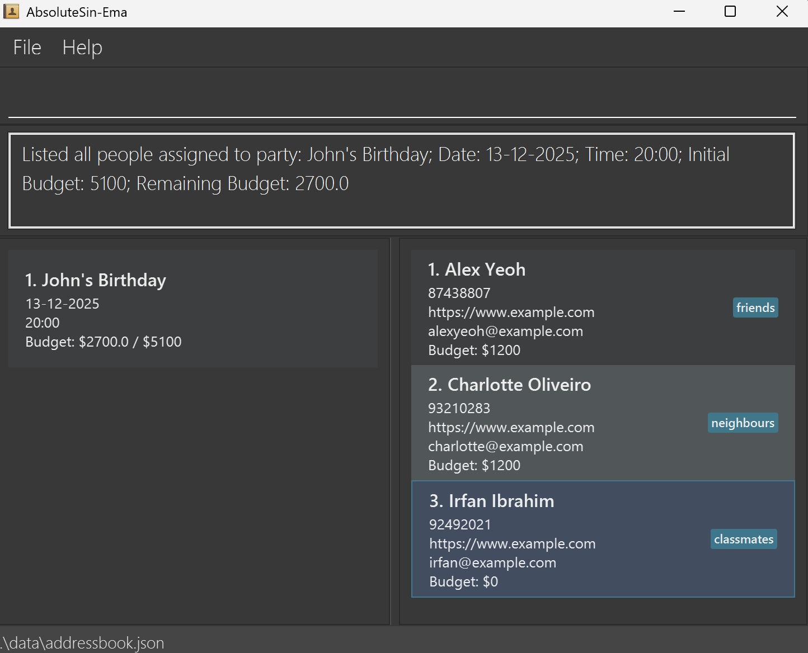

### Clearing all entries: `clear`

Clears all parties, contacts, or both, from the AbsolutSin-ema.

Format: `clear all/parties/contacts`

Upon executing the `clear` command, a confirmation message will appear to prevent accidental data loss. You must confirm the action to proceed.

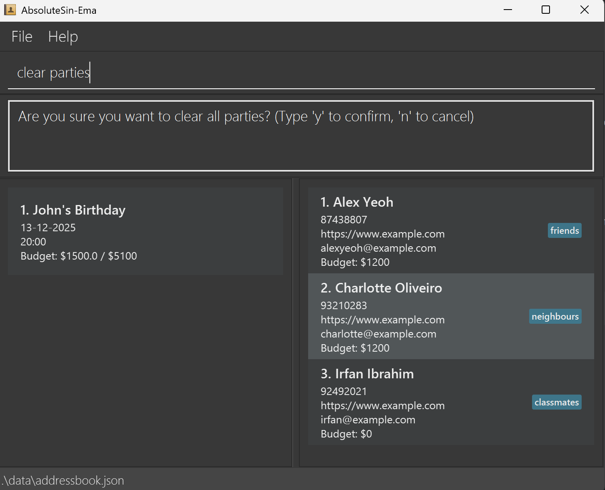

**Warning:**
This will delete ALL contacts permanently. While this action can be undone, it should still be used with caution.

### Undoing the previous command: `undo`

Undoes the most recent add, delete, edit, clear, or any party-related command. This restores AbsolutSin-ema to the state before the last command was executed.

Format: `undo`

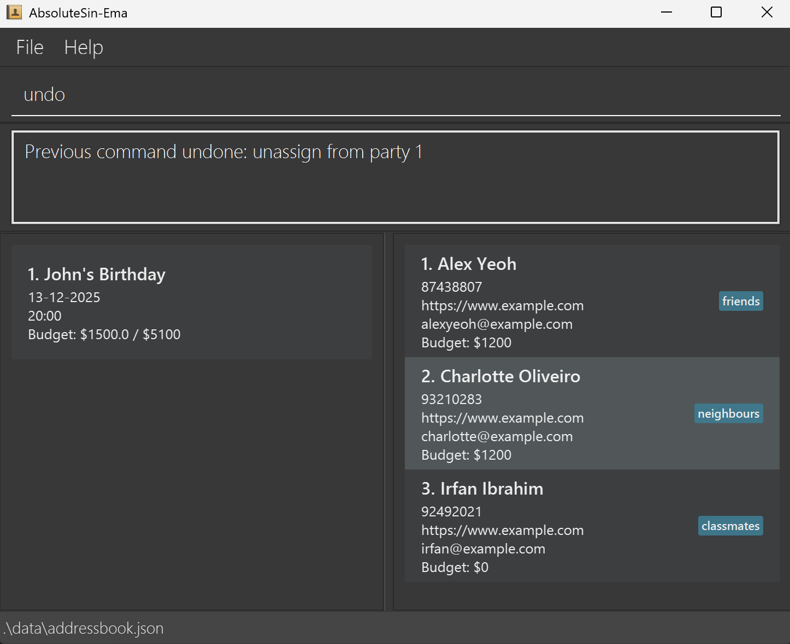

**Commands that can be undone:**
- `add` - Removes the person that was added
- `delete` - Restores the person that was deleted
- `edit` - Restores the person to their previous state
- `clear` - Restores all contacts and/or parties that were cleared
- `addp` - Removes the party that was added
- `editp` - Restores the party to its previous state
- `deletep` - Restores the party that was deleted
- `assign` - Reverts the assignment of contacts to a party
- `unassign` - Reverts the removal of contacts from a party

 Note:
Only one level of undo is supported. You can only undo the most recent command. You cannot undo an undo command (i.e., there is no redo functionality).

 ⚠️ Important:
Commands like `find`, `list`, `help`, and `exit` do not modify data and therefore cannot be undone. The undo command will only affect the most recent command that actually changed your contacts or parties.

**Examples:**
* After running `addp n/John's Birthday d/12-12-2025 t/18:00 b/5000`, typing `undo` will remove the party from your party list.
* After running `assign 1 c/2`, typing `undo` will unassign contact 2 from the 1st party.
* After running `deletep 2`, typing `undo` will restore the 2nd party back to your party list.

### Exiting the program: `exit`

Exits the program.

Format: `exit`

### Saving the data

AbsolutSin-ema data are saved in the hard disk automatically after any command that changes the data. There is no need to save manually.

### Editing the data file

AbsolutSin-ema data are saved automatically as a JSON file `[JAR file location]/data/absolutsinema.json`. Advanced users are welcome to update data directly by editing that data file.

 ⚠️ Caution:
If your changes to the data file makes its format invalid, or the value inputted is invalid, AbsolutSin-ema will discard all data and start with an empty data file at the next run. Hence, it is recommended to take a backup of the file before editing it. 
Edit the data file only if you are confident that you can update it correctly.

--------------------------------------------------------------------------------------------------------------------

## FAQ

**Q**: How do I transfer my data to another computer? 
**A**: Install AbsolutSin-ema on the new computer and overwrite the empty data file it creates with the file that contains the data of your previous AbsolutSin-ema home folder. The data file is located at `[JAR file location]/data/absolutsinema.json`.

**Q**: What happens if I accidentally delete a contact? 
**A**: You can use the `undo` command to restore the deleted contact immediately after the deletion. If you have performed other commands after the deletion, you will need to add the contact again manually.

**Q**: Why can't I find a contact even though I know they exist? 
**A**: The `find` command only searches by name and requires exact word matches. Make sure you're typing the exact words that appear in the contact's name. Use `list` to see all contacts if needed.

**Q**: Can I have two contacts with the same name? 
**A**: No, AbsolutSin-ema does not allow duplicate names. Each contact must have a unique name. If you try to add a contact with an existing name, you will get an error message.

**Q**: What happens if I use `clear contacts` or `clear parties`? 
**A**: `clear contacts` will remove all contacts but keep your parties intact. Any parties that previously had assigned contacts will now show no participants.  
`clear parties` will remove all parties while keeping your contacts untouched. Use `clear all` to remove both.

**Q**: Can I undo a `clear all/contacts/parties` command? 
**A**: Yes. If you accidentally clear data, you can immediately type `undo` to restore everything to its previous state. Only one level of undo is supported.

**Q**: Will clearing parties also delete the contacts assigned to them? 
**A**: No. Clearing parties only removes the party entries. The contacts themselves will remain in the contact list.

**Q**: Can I assign the same contact to multiple parties? 
**A**: Yes. A contact can belong to multiple parties at once. Each party tracks its own list of assigned contacts independently.

**Q**: What if I unassign a contact who is not part of that party? 
**A**: The command will show an error message. Only contacts currently assigned to that specific party can be unassigned.

**Q**: What happens if I use `undo` multiple times? 
**A**: AbsolutSin-ema currently supports only **one level of undo**. Running `undo` again after restoring data will not revert earlier actions.

**Q**: How can I verify that a contact was successfully assigned to a party? 
**A**: After using the `assign` command, run `view INDEX` (where `INDEX` refers to the party) to see the list of assigned contacts.

**Q**: What should I do if the application won't start? 
**A**: Ensure you have Java 17 or above installed. Check that the jar file is not corrupted by re-downloading it. Make sure you're running the command `java -jar absolutsin-ema.jar` from the correct directory. See the [Troubleshooting](#troubleshooting) section for more detailed steps.

**Q**: Can I backup my data? 
**A**: Yes, simply copy the `absolutsinema.json` file from the data folder to a safe location. You can restore it later by copying it back. It's recommended to backup your data regularly.

**Q**: Are my contacts searchable by phone number or email? 
**A**: Currently, the `find` command only searches by name and tag. To find contacts by other fields, use the `list` command to view all contacts and manually search through them.

**Q**: What characters are allowed in names and addresses? 
**A**: Names can contain letters, numbers, and spaces. Addresses can contain any characters including special symbols, making them flexible for international addresses.

--------------------------------------------------------------------------------------------------------------------

## Known issues

1. **When using multiple screens**, if you move the application to a secondary screen, and later switch to using only the primary screen, the GUI will open off-screen. The remedy is to delete the `preferences.json` file created by the application before running the application again.

--------------------------------------------------------------------------------------------------------------------

## Command summary

Action | Format, Examples
--------|------------------
**Add** | `add n/NAME p/PHONE_NUMBER e/EMAIL [w/WEBSITE] b/BUDGET [t/TAG]…​`   e.g., `add n/DJ Alex p/91234567 e/alex@mixmaster.com w/djalexit.com b/800 t/dj t/music`
**Add Party** | `addp n/NAME d/DATE t/TIME b/BUDGET [c/CONTACT_INDEX...]`   e.g., `addp n/Corporate Gala d/15-03-2025 t/19:30 b/15000 c/1,2,3`
**Clear** | `clear all/parties/contacts`
**Delete** | `delete INDEX`  e.g., `delete 3`
**Delete Party** | `deletep INDEX`   e.g., `deletep 2`
**Edit** | `edit INDEX [n/NAME] [p/PHONE_NUMBER] [e/EMAIL] [w/WEBSITE] [t/TAG]... [b/BUDGET]`  e.g.,`edit 2 n/Premium Catering Co e/bookings@premiumcatering.com b/1500`
**Edit Party** | `editp INDEX [n/NAME] [d/DATE] [t/TIME] [b/BUDGET]`   e.g., `editp 1 n/Annual Company Party d/20-12-2025 t/18:30 b/25000`
**Exit** | `exit`
**Assign to Party** | `assign PARTY_INDEX c/CONTACT_INDEX...`   e.g., `assign 1 c/1,2,3`
**Unassign from Party** | `unassign PARTY_INDEX c/CONTACT_INDEX...`   e.g., `unassign 1 c/2,3`
**Find** | `find KEYWORD [MORE_KEYWORDS]`  e.g., `find catering`, `find DJ photographer`
**List** | `list`
**List Tags** | `listtags`
**Undo** | `undo`
**View Party** | `view INDEX`   e.g., `view 1`
**Help** | `help`

